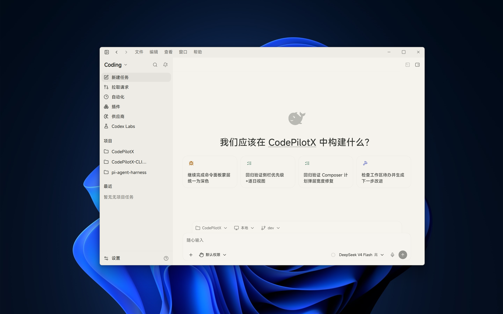
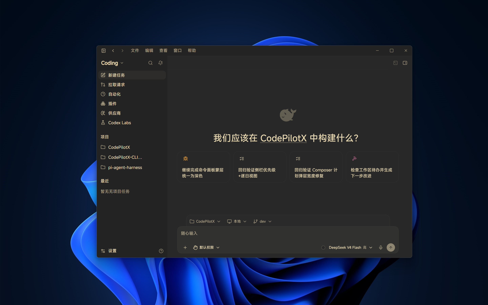
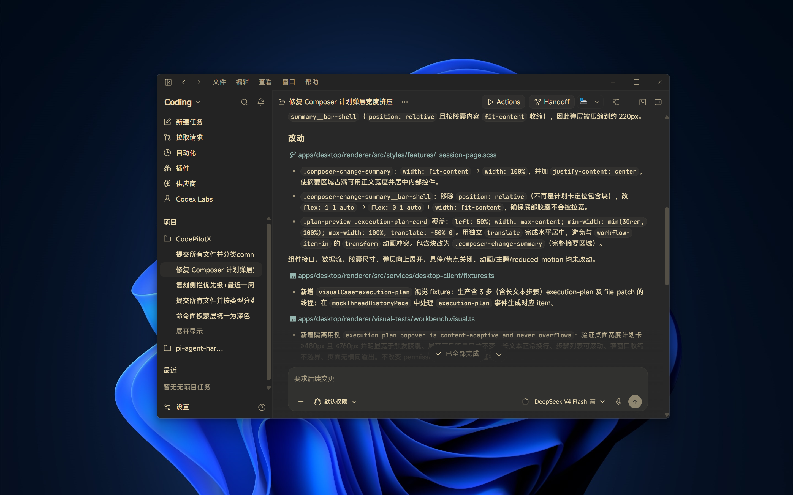
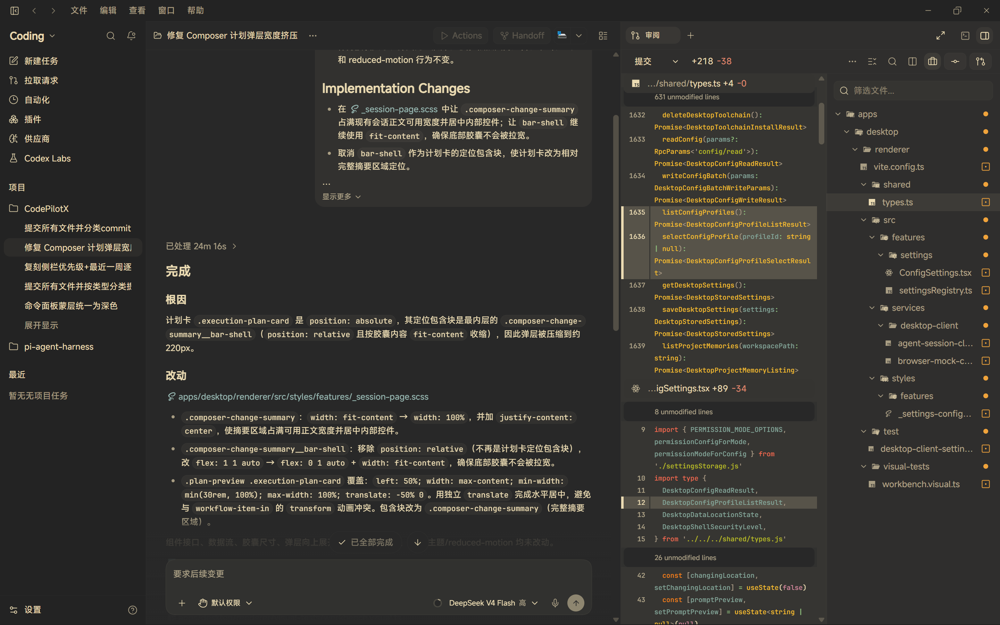

# CodePilotX

面向 Windows 的开源桌面 AI 编程工作台，让 AI 在真实项目中完成理解、修改、命令执行、代码审阅与 Git 协作。

_Open-source, Windows-first desktop workspace for AI-assisted coding._

[](https://github.com/codepilotx-dev/CodePilotX/releases)
[](LICENSE)

> [!IMPORTANT]
> CodePilotX 当前处于 Beta 阶段，仅提供 Windows x64 版本。

## 界面预览

### 浅色与深色主题

首页集中展示项目、任务、模型、推理等级和权限选择，并支持浅色与深色主题。





### 从任务执行到代码审阅

在一个工作台中查看任务执行过程、文件变更摘要、代码 Diff 和文件树，并在落地修改前完成审阅。





## 核心能力

- **项目与任务工作台**：管理多项目、多文件夹和多任务，支持会话恢复、文件浏览与任务状态整理。
- **Agent 编程流程**：执行结构化文件读取与修改、Shell 命令和计划，在关键节点处理权限审批、结构化提问、中断恢复与上下文管理。
- **代码审阅与 Git**：提供统一或分离 Diff、文件树、行级评论、暂存、取消暂存、还原、提交、推送与 Pull Request 操作。
- **模型与供应商**：通过 Pi Provider 目录管理 API Key、OAuth、自定义 Endpoint、自定义模型和推理等级。
- **扩展与工具**：统一管理 Skills、Plugins 与 MCP，并提供内置浏览器、集成终端、Actions 和工作空间依赖。
- **并行与隔离工作流**：支持子智能体、托管 worktree、任务 Handoff、项目记忆和 Profile 配置。

## 下载与安装

前往 [GitHub Releases](https://github.com/codepilotx-dev/CodePilotX/releases)，下载最新的 `CodePilotX-*-x64.exe` Beta 安装程序。

1. 运行 Windows x64 安装程序。
2. 打开或导入一个本地 Git 项目。
3. 在“供应商”中配置 API Key、OAuth 或自定义 Endpoint。
4. 新建任务，选择模型、推理等级与权限模式后开始工作。

请勿在公开 Issue、日志或截图中暴露 API Key、访问令牌或真实用户数据。安全问题请按[安全策略](SECURITY.md)私密报告。

## 从源码开发

环境要求：Windows、Git、Bun 1.3.14。

```powershell
git clone https://github.com/codepilotx-dev/CodePilotX.git
Set-Location CodePilotX
bun install --frozen-lockfile
bun run dev
```

常用验证命令：

```powershell
bun run typecheck
bun run build:renderer
bun run build:agent
bun run build:desktop
```

`bun run package:win` 用于生成 Windows x64 NSIS 安装包，不属于普通开发流程的必跑命令。参与开发前请阅读[贡献指南](CONTRIBUTING.md)。

## 架构概览

CodePilotX 是一个 Windows-first TypeScript monorepo，统一使用 Bun 1.3.14。

```text
apps/
├─ agent/                 会话、存储、Provider、工具、权限、编排与 RPC
├─ auth-broker/           OAuth 与认证协作
└─ desktop/
   ├─ electron/           Electron 主进程、preload、窗口、sidecar 与打包
   └─ renderer/           React + Vite 桌面工作台
packages/                 共享契约、RPC v4、会话投影、模型 schema 与 Agent runtime
```

系统能力沿固定边界流动：

```text
renderer
  → typed preload bridge / Agent client
  → Electron / Agent service
  → repositories / filesystem / provider
```

- Electron 主进程负责桌面系统能力和 Agent sidecar 生命周期。
- Agent 负责会话、SQLite、Provider、工具、权限、编排与 `thread-rpc-v4`。
- Renderer 不直接访问 Node、SQLite、凭据或文件系统。
- 更详细的协议和数据设计见 [`docs/architecture/`](docs/architecture/)，仓库约束见 [`AGENTS.md`](AGENTS.md)。

## 安全、数据与恢复

- 文件、Shell、网络和 MCP 等能力受权限模式、审批策略与风险控制约束。
- Renderer 只通过类型化 preload bridge 或 Agent client 调用系统能力，不获得 Node 或任意 IPC 访问权限。
- Provider 凭据不写入 SQLite，也不会进入会话、日志、事件或错误信息。
- Agent 使用 `bun:sqlite`，启用 WAL、外键和 busy timeout；业务变更与事件 outbox 在同一事务提交，SSE 支持 cursor replay 与 heartbeat。
- 异常退出时保留中断恢复语义，不会自动重放具有副作用的工具操作。
- 数据迁移保留未来版本的 `user_version`、未知表、未知字段和未知记录，不会通过删除整个用户数据目录尝试恢复启动。

如需报告漏洞，请使用 [`SECURITY.md`](SECURITY.md) 中的私密披露渠道，不要创建包含利用细节或敏感数据的公开 Issue。

## 开源协作

- [参与贡献](CONTRIBUTING.md)：开发环境、分支、提交和 Pull Request 规则。
- [行为准则](CODE_OF_CONDUCT.md)：社区协作约定。
- [安全策略](SECURITY.md)：支持范围与漏洞私密披露流程。
- [变更记录](CHANGELOG.md)：已发布版本与 Unreleased 变更。
- [Apache License 2.0](LICENSE)：项目许可证。
