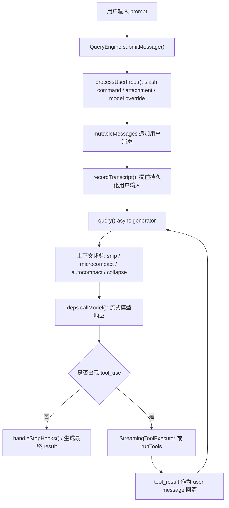
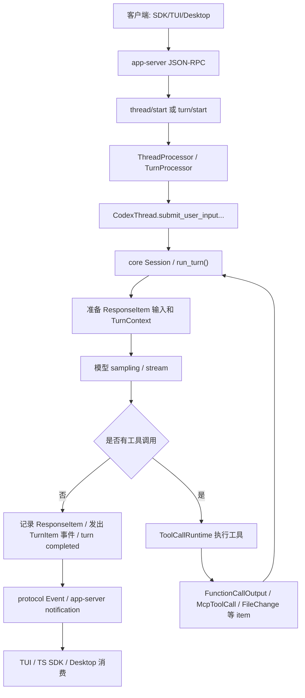

# Codex CLI 与当前项目对话流/工作流差异分析

本文比较两个代码库：

- 当前项目：`D:\VueProject\ClaudeCode`
- Codex CLI：`D:\GitHubProject\codex-main`

重点范围是对话流、工作流、thread/turn 生命周期、工具执行、权限审批、上下文压缩和会话持久化。分析基于源码只读检查，不涉及运行时行为假设。

## 高层结论

当前项目是一个以 TypeScript/TSX 为中心的 agent/TUI/桌面一体化实现。核心对话循环直接落在 `apps\tui\src\QueryEngine.ts` 和 `apps\tui\src\query.ts`，通过 async generator 持续产出 SDK/TUI 可消费的消息。桌面侧再通过 `apps\desktop\src\main\agentRuntime.ts` 启动或桥接该 agent，并把事件映射成桌面 UI 的消息、工具日志、权限请求等。

Codex CLI 是更强分层的 Rust-first 架构。`codex-rs\core` 负责 session、turn、工具、权限和持久化；`codex-rs\app-server` 通过 JSON-RPC v2 暴露 thread/turn 生命周期；`codex-rs\protocol` 定义稳定事件和 item 模型；TUI、桌面、TypeScript SDK 都消费同一套协议事件。它不是把 UI 直接接在模型循环上，而是把 “线程/轮次/事件/item” 当作产品级协议边界。

最核心的差异可以概括为：

1. 当前项目的主循环是应用内函数调用链，Codex 的主循环是协议化服务调用链。
2. 当前项目用 `mutableMessages` 和 transcript 维护对话状态，Codex 用 `ResponseItem`、rollout、thread-store 和协议事件维护可重放状态。
3. 当前项目的工具执行与消息循环高度耦合，Codex 把工具调用抽象成 `TurnItem`/事件，并由 core runtime 调度。
4. 当前项目的桌面层更像 agent 子进程适配器，Codex 的客户端层更像 app-server 协议客户端。
5. Codex 对 thread/turn 的建模更完整：start、resume、fork、rollback、steer、interrupt、inject items 都是显式 API。

## 当前项目对话流

当前项目的核心入口是 `QueryEngine.submitMessage()`。它的职责很重：处理用户输入、构造系统提示、注入 memory/plugin/skill 上下文、维护 `mutableMessages`、调用 `query()`、记录 transcript、转换 SDK 输出、累计 usage 和 permission denials。

简化流程如下：

`apps\tui\src\query.ts` 是真正的 “模型-工具-模型” 循环。它在 `while (true)` 中做以下事情：

- 从最近 compact boundary 之后的消息构造 `messagesForQuery`。
- 执行 snip、microcompact、context collapse、autocompact 等上下文处理。
- 调用 `deps.callModel()` 获取流式模型输出。
- 在流中收集 assistant message 与 `tool_use` block。
- 如果启用 streaming tool execution，边流式接收边启动 `StreamingToolExecutor`。
- 如果没有工具调用，执行 stop hooks 并结束。
- 如果有工具调用，执行工具，把 `tool_result` 作为用户消息加入下一轮。
- 检查 abort、max turns、max output tokens、prompt too long、image/media 错误等恢复路径。

工具执行主要有两条路径：

- `apps\tui\src\services\tools\StreamingToolExecutor.ts`：在模型流还没完全结束时尝试提前调度工具，支持并发安全判断、兄弟工具失败级联 abort、合成错误 tool result。
- `apps\tui\src\services\tools\toolOrchestration.ts`：传统路径，先按并发安全性分区，读类/安全工具并发执行，非并发安全工具串行执行。

桌面接入并没有把 thread/turn 协议作为稳定边界，而是围绕 agent runtime 事件做适配。`packages\core\src\agent\runtime.ts` 定义了桌面可见的事件类型，如 `message`、`assistant_delta`、`tool_call`、`tool_result`、`permission_request`、`context_usage`、`diff`、`done`。`apps\desktop\src\shared\sessionEventModel.ts` 再把这些 runtime event 归一化为桌面消息和工具日志。

## Codex 对话流

Codex 的设计中心不是 `query()` 函数，而是 thread/turn 协议和 Rust core session。

外层请求从 app-server 进入：

- `codex-rs\app-server-protocol\src\protocol\v2\thread.rs` 定义 `ThreadStartParams`、`ThreadStartResponse` 等 thread API。
- `codex-rs\app-server-protocol\src\protocol\v2\turn.rs` 定义 `TurnStartParams`、`TurnSteerParams`、`TurnStartedNotification` 等 turn API。
- `codex-rs\app-server\src\message_processor.rs` 把 JSON-RPC 请求分发给 `thread_processor`、`turn_processor` 等处理器。
- `codex-rs\app-server\src\request_processors\turn_processor.rs` 的 `turn_start()` 最终调用 `submit_user_input_with_client_user_message_id()` 把 turn 输入交给 core thread/session。

core 侧的真正模型循环在 `codex-rs\core\src\session\turn.rs`。`run_turn()` 注释明确说明它会持续循环：模型要么返回 function calls，要么返回最终 message；function calls 会被执行并把输出追加回对话历史，继续下一次 sampling request。

简化流程如下：

Codex 的 TypeScript SDK 是薄客户端。`sdk\typescript\src\thread.ts` 中的 `Thread.runStreamed()` 只是把输入归一化后调用 `CodexExec.run()`，解析 JSONL 事件；`Thread.run()` 则消费这些事件，收集 `item.completed` 中的 `agent_message` 作为最终响应。SDK 不持有真正的模型循环逻辑。

## 对照表

| 维度 | 当前项目 `D:\VueProject\ClaudeCode` | Codex CLI `D:\GitHubProject\codex-main` |
| --- | --- | --- |
| 主要语言/形态 | TypeScript/TSX，TUI、SDK、桌面桥接逻辑集中 | Rust core/app-server/protocol，加 TypeScript SDK 和 Node CLI wrapper |
| 对话主入口 | `apps\tui\src\QueryEngine.ts` 的 `submitMessage()` / `ask()` | `codex-rs\app-server` 的 `thread/start`、`turn/start`，最终进入 `codex-rs\core` |
| 模型循环 | `apps\tui\src\query.ts` 的 async generator + `while (true)` | `codex-rs\core\src\session\turn.rs` 的 `run_turn()` 和内部 sampling loop |
| 状态载体 | `mutableMessages: Message[]`、AppState、read file cache、transcript | `ResponseItem`、`TurnInput`、rollout、thread-store、session state |
| 输出模型 | 直接 yield `SDKMessage` / internal `Message`，桌面再映射 | 协议化 `Event`、`TurnItem`、notification，SDK/TUI 统一消费 |
| thread/turn 概念 | “一次 submitMessage 触发一个查询循环”，turn 更多是内部计数 | thread 和 turn 是显式 API：start、resume、fork、rollback、steer、interrupt、inject |
| 工具调用 | `tool_use` block -> `StreamingToolExecutor` 或 `runTools()` -> user `tool_result` | model tool call -> `ToolCallRuntime` / tool router -> protocol item/event |
| 工具并发 | 按工具并发安全性分区；可在流式响应中提前启动工具 | core runtime 统一调度，工具结果映射为稳定 item，如 MCP、file change、web search |
| 权限审批 | `canUseTool`、permission mode、pre/post hooks、permission denials | approval policy、permission profile、request permissions、guardian/auto-review |
| 上下文压缩 | query loop 内执行 snip、microcompact、autocompact、reactive compact、collapse | core session 中执行 pre-sampling/auto compact，持久化 compacted history |
| 会话持久化 | `recordTranscript()` 写 transcript，`mutableMessages` 维持当前进程上下文 | rollout/thread-store 记录可重放历史，支持 resume/fork/rollback |
| 桌面集成 | 桌面 main 进程通过 agent runtime 事件适配 UI | app-server 协议天然支持多客户端订阅和 thread 生命周期管理 |
| SDK 职责 | `QueryEngine` 本身承担大量 SDK/headless 逻辑 | TS SDK 是薄封装，主要解析 JSONL thread events |

## 工作流差异详解

### 1. 当前项目是“函数式内聚工作流”

当前项目把大量工作流逻辑放在一个可直接调用的 TypeScript generator 中。优点是链路短、调试直接、前端/SDK 能共享同一套 `query()` 输出。缺点是职责边界容易变厚：输入处理、上下文压缩、工具调度、权限记录、transcript、SDK result 组装都在 `QueryEngine` 和 `query()` 附近交织。

这种结构适合快速迭代 TUI/headless 行为，但当要支持更多客户端、远程线程、多会话恢复、跨进程订阅和稳定外部 API 时，会遇到协议边界不足的问题。

### 2. Codex 是“协议化 thread/turn 工作流”

Codex 把 thread 和 turn 作为一等概念暴露。客户端不直接调用模型循环，而是发起 `thread/start`、`turn/start`、`turn/steer`、`turn/interrupt` 等请求。core 产生的状态变化通过协议事件传播。

这种结构的好处是：

- 客户端可以薄化，TUI、SDK、桌面共享协议。
- 会话恢复、fork、rollback、订阅、状态查询都有稳定位置。
- 工具、权限、文件变更、MCP 调用都可以统一建模为 item/event。
- core 可以独立演进，不需要把 UI/SDK 语义塞进模型循环。

代价是系统更复杂，需要维护 app-server、protocol schema、事件兼容性和更多测试面。

### 3. 当前项目的工具结果更贴近模型消息，Codex 更贴近产品事件

当前项目工具执行后主要把结果构造成 user-side `tool_result`，再交回下一轮模型调用。这符合 Claude-style tool use 的直接模型协议，也便于在同一个消息数组中继续上下文。

Codex 则会把工具过程映射为用户可见 item，例如 command execution、file change、MCP tool call、web search、reasoning、agent message 等。模型输入仍然需要 tool output，但 UI 和 SDK 看到的是更稳定的事件/item 层。

换句话说，当前项目的工具流以“模型需要什么”为中心；Codex 的工具流同时服务“模型继续推理”和“客户端可观察工作流”。

### 4. 权限模型的边界不同

当前项目的权限判断主要嵌在工具执行前后：`canUseTool`、permission mode、hook permission decision、permission request、permission denial tracking。它非常贴近具体工具调用，便于对 Bash/Edit/MCP 等工具做局部策略。

Codex 权限模型更系统化：配置中有 approval policy、permission profile、sandbox policy、approvals reviewer；运行时可以 request permissions；guardian/auto-review 可以介入审批。它把权限当作 thread/turn 配置和运行时请求的一部分，而不仅是工具函数前置检查。

### 5. 持久化与恢复能力差异明显

当前项目为了恢复 headless/desktop 会话，在用户输入进入 query loop 前就调用 `recordTranscript()`。这解决了进程被杀时没有 API 响应导致无法 resume 的问题，但本质上仍是 transcript 追加模型。

Codex 的 rollout/thread-store 更接近事件溯源。它记录 `ResponseItem`、compacted item、turn context 等，使 resume、fork、rollback、compaction 后历史重建都有统一基础。这也是 Codex 能把 thread 生命周期做成服务 API 的前提。

## 对当前项目的启示

如果当前项目只是继续服务现有 TUI/桌面 agent，保留 `QueryEngine + query()` 的内聚形态是合理的。它的开发成本低，现有工具、hook、compact 逻辑已经围绕这个循环深度集成。

如果当前项目要向 Codex 的方向演进，最值得借鉴的不是直接重写 Rust core，而是先引入更清晰的协议边界：

1. 定义稳定的 `ThreadEvent` / `TurnItem` 层，减少桌面 UI 直接依赖内部 `Message` 形状。
2. 把 `submitMessage()` 拆出 thread/turn 生命周期语义，至少显式表达 start、interrupt、resume、rollback。
3. 将工具执行过程同时产出 model-facing `tool_result` 和 client-facing item event。
4. 把权限配置从工具局部判断提升为 session/thread setting，并保留工具级 override。
5. 让 transcript/历史记录从“消息数组快照”逐步转为“可重放事件或 item 序列”。

## 迁移成本判断

低成本可借鉴：

- 为桌面/SDK 定义更稳定的事件 union，弱化对内部消息类型的耦合。
- 在现有 `QueryEngine` 外层增加 thread/turn facade，不立即改动 `query()`。
- 将 `tool_start`、`tool_result`、`diff`、`permission_request` 规范化为 item-style 输出。
- 对 resume/fork/rollback 增加更明确的 metadata 和测试。

中等成本：

- 把 `mutableMessages` 的持久化语义拆成 runtime context 与 persisted history 两层。
- 统一 TUI、desktop、SDK 对 result、usage、permission denial、compact boundary 的消费模型。
- 把工具并发、abort、sibling failure 等行为沉到更独立的 runtime 层。

高成本：

- 完整复制 Codex 的 app-server/protocol/thread-store 架构。
- 将当前 TypeScript core loop 迁移为 Rust core 或跨进程服务。
- 让所有 UI 都改为订阅协议事件，而不再共享内部 agent state。
- 兼容已有 transcript、compact boundary、sourceMappingURL artifact、桌面 agent 子进程协议。

## 建议路线

如果目标是提升当前项目的工程清晰度，而不是全面重构，建议分三步：

1. 先做事件层标准化：定义 `TurnEvent` / `TurnItem`，由 `QueryEngine` 继续驱动，但输出更接近 Codex 的 item 模型。
2. 再做生命周期 facade：在 `QueryEngine` 外包一层 `ThreadRuntime`，显式支持 start、send、interrupt、resume，并把桌面 runtime 改为调用 facade。
3. 最后再考虑持久化重构：把 transcript 从 message dump 演进为 item/event log，为 fork/rollback/跨客户端订阅打基础。

不建议第一步就照搬 Codex app-server。当前项目已有大量 TS 工具、hook、compact、desktop 适配逻辑，直接协议化重写会扩大风险。更稳妥的方向是先把现有行为投影成稳定事件，再逐步让内部实现靠近 Codex 的 thread/turn 模型。

