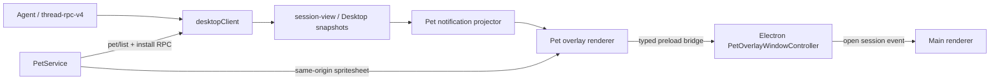

# CodePilotX 宠物系统复刻规格

本文是 CodePilotX 宠物系统的实现与验收规格。它将逆向结果转化为仓库内可维护的模块边界，覆盖 v1/v2 宠物包、Agent 安装服务、Electron overlay、Renderer 动画和跨任务提醒。

逆向证据与不可恢复边界见 [Codex 宠物系统逆向分析](research/codex-pet-system-reverse-engineering.md)。

## 用户结果

用户可以：

1. 在“设置 → 宠物”唤醒或收起桌面宠物。
2. 从 HTTPS `pet.json` 地址预览并安装自定义宠物。
3. 选择已安装宠物，将显示尺寸调整为 80–224 px。
4. 分别启用需要处理、完成和失败提醒。
5. 在透明浮窗中查看最高优先级提醒并打开对应任务。
6. 拖动宠物；应用重启或显示器变化后恢复到可见位置。

## 架构



依赖方向保持：

```text
renderer
  -> typed bridge / Agent client
  -> Electron / Agent service
  -> owned storage
```

禁止：

- Renderer 直接读取文件系统。
- Electron 保存任务、审批或问题真值。
- Agent 依赖 Renderer 或 Electron。
- 新建第二套 SSE、session store 或 legacy RPC 协议。

## 包契约

### `pet.json`

```ts
type PetManifest = {
  id: string
  displayName: string
  description?: string
  spriteVersionNumber: 1 | 2
  spritesheetPath: string
}
```

约束：

- `id`: `^[a-z0-9][a-z0-9-]{0,63}$`
- `displayName`: 1–100 字符
- `description`: 最多 500 字符
- `spritesheetPath`: 包内相对路径，禁止绝对路径、NUL 和 `..`
- 格式：PNG 或 WebP
- 最大图集：20 MiB
- v1：1536×1872
- v2：1536×2288

### 安装根

默认使用 CodePilotX 数据目录中的 `pets`。若显式设置 `CODEX_HOME`，可以读取其 `pets` 子目录；`CODEPILOTX_PETS_DIR` 可覆盖根目录。

所有删除和替换只能发生在解析后的宠物根内，不能删除整个 data dir、userData 或 `$HOME`。

## Agent

### RPC

能力：`pets.management.v1`

| 方法 | 参数 | 结果 | mutation |
|---|---|---|---|
| `pet/list` | `{}` | `{pets}` | 否 |
| `pet/install/preview` | `{url}` | `{pet,sourceUrl,sizeBytes}` | 否 |
| `pet/install` | `{url,operationId}` | `{pet}` | 是 |
| `pet/remove` | `{id,operationId}` | `{id,removed:true}` | 是 |

公共 descriptor 不包含绝对路径：

```ts
type PetDescriptor = PetManifest & {
  spritesheetUrl: string
  installed: boolean
}
```

错误码：

- `PET_NOT_FOUND`
- `PET_INVALID`
- `PET_DOWNLOAD_FAILED`
- `PATH_DENIED`
- `CONFLICT`
- `RATE_LIMITED`
- `INTERNAL_ERROR`

### 下载策略

- 仅 HTTPS；`localhost`、`127.0.0.1`、`::1` 允许 HTTP。
- 不允许 URL userinfo。
- `redirect: manual`，拒绝所有常见 3xx redirect。
- 15 秒下载超时。
- 同时检查 Content-Length 和实际读取字节。
- MIME 与 magic 必须同时为 PNG/WebP。
- 安装先写同根 staging，再切换到目标目录。

### 资源路由

```http
GET /api/pets/:id/spritesheet
```

响应：

```text
Content-Type: image/png | image/webp
Cache-Control: private, max-age=0, must-revalidate
ETag: "<sha256>"
X-Content-Type-Options: nosniff
```

路由位于既有 `/api/*` 认证和同源门禁后。它只接收 pet ID，不接收任意相对或绝对路径。

### 校验层级

生产运行时 TypeScript 校验负责：

- URL、路径和包边界
- MIME 与文件 magic
- 字节上限
- PNG/WebP 尺寸
- v1/v2 行数

完整像素级 QA（alpha、unused cell、透明像素 RGB residue、方向语义和连贯性）由 `hatch-pet` 制作流程负责。当前 Agent 不引入 `sharp` 等原生图像依赖，以避免扩大 Windows sidecar 打包面；将来若要求接收未经制作工具校验的第三方包，应新增纯运行时解码器或经过安全评估的图像依赖。

## Electron

### 模块

```text
apps/desktop/electron/src/
  windows/pet-overlay-window.ts
  windows/pet-overlay-window-state.ts
  ipc/register-pet-overlay-ipc.ts
```

`main.ts` 只负责装配：

1. 加载独立 pet bounds。
2. 创建 `PetOverlayWindowController`。
3. 注册 pet IPC。
4. Agent origin 验证成功后绑定固定 overlay route。
5. 退出时 flush bounds。

### BrowserWindow

固定 viewport：356×320 DIP。

安全选项：

```ts
{
  contextIsolation: true,
  nodeIntegration: false,
  sandbox: true,
  webSecurity: true
}
```

窗口行为：

- transparent、frameless
- always on top：`floating`
- visible on all workspaces
- skip taskbar
- 初始 focusable false
- 初始 ignore mouse events true
- `setWindowOpenHandler` 一律 deny
- `will-navigate` 只允许已验证 Agent origin

主进程只加载：

```text
<verified-agent-origin>/#/pet-overlay
```

Renderer 不能传入 URL。

### Typed bridge

契约源：`@codepilotx/shared/desktop-pet-overlay`

```ts
interface DesktopPetOverlayBridge {
  openPetOverlay(): Promise<void>
  hidePetOverlay(): Promise<void>
  getPetOverlayWindowState(): Promise<DesktopPetOverlayWindowState>
  beginPetDrag(): void
  updatePetDrag(): void
  endPetDrag(): void
  setPetPointerPassthrough(passthrough: boolean): void
  requestPetKeyboardFocus(focused: boolean): Promise<void>
  openPetSession(sessionId: string): Promise<void>
  onPetOpenSession(listener: (sessionId: string) => void): () => void
}
```

每个 IPC handler 都验证 sender。拖拽坐标由 main 使用 `screen.getCursorScreenPoint()` 计算，Renderer 不能传入任意 bounds。

### Bounds

状态文件：`pet-overlay-window-state.json`

规则：

- 默认位于主显示器右下，边距 24 DIP。
- 按与各 display work area 的交集选择恢复显示器。
- 完全离屏时回到主显示器。
- x/y 始终 clamp 到 work area。
- 250 ms 防抖、串行写入、临时文件 rename。

## Renderer

### 路由

`/pet-overlay` 是 `DesktopLayout` 外的顶层 lazy route。它不加载侧栏、Workbench、composer 或完整 `useSessionState`。

`App.tsx` 现有主题和设置 Provider 继续包住该 route。

### 设置

```ts
type DesktopPetSettings = {
  enabled: boolean
  selectedPetId: string | null
  size: number
  notifyAttention: boolean
  notifyCompletion: boolean
  notifyFailure: boolean
}
```

默认：

```ts
{
  enabled: false,
  selectedPetId: null,
  size: 112,
  notifyAttention: true,
  notifyCompletion: true,
  notifyFailure: true
}
```

设置经过 `normalizeDesktopStoredSettings`。size 取整并 clamp 到 80–224；非法 pet ID 回退 null。

### 通知投影

输入是 `DesktopSessionSnapshot[]`，来自既有：

- `desktopClient.listSessions()`
- `desktopClient.onSessionStoreChange()`

持久通知：

- `view.pendingPermissions`
- 稳定 ID：`${threadId}:${requestId}`
- request 消失、用户 dismiss 或任务归档后消失

状态边通知：

- 非 done → done：`completed`，15 秒
- 非 error → error：`failed`，30 秒
- ID 包含 `updatedAt`

过滤：

- archived task
- `source === internal_guardian`

优先级：

```text
question / plan: 100
approval / exec / network / tool: 90
failed: 80
completed: 40
```

### 动画

运行时使用 TypeScript timer，因为各帧时长不一致。标准 9 行与时长以逆向报告为准。

spritesheet 裁切：

```ts
const rows = spriteVersionNumber === 2 ? 11 : 9
backgroundSize = `800% ${rows * 100}%`
backgroundPosition =
  `${column * (100 / 7)}% ${row * (100 / (rows - 1))}%`
```

显示比例保持 192:208。reduced motion 下固定第 0 帧。非 idle 播放 3 次后回到 idle。

### 点击穿透和拖拽

页面根 `pointer-events: none`。宠物和 pill 是明确交互区域：

- pointer enter：关闭点击穿透
- pointer leave：恢复点击穿透
- pointer down：begin drag
- pointer move：update drag
- pointer up：end drag

打开任务只调用 `openPetSession(threadId)`；Electron 把事件发给主 renderer，主 renderer 使用现有 `sessionPath` 导航。

## 当前实现文件

协议与 Agent：

- `packages/agent-protocol/src/methods/pet.ts`
- `apps/agent/src/pet/PetService.ts`
- `apps/agent/src/transport/rpc/handlers/pet.ts`
- `apps/agent/src/transport/server.ts`

Electron：

- `packages/shared/src/desktop-pet-overlay.ts`
- `apps/desktop/electron/src/windows/pet-overlay-window.ts`
- `apps/desktop/electron/src/windows/pet-overlay-window-state.ts`
- `apps/desktop/electron/src/ipc/register-pet-overlay-ipc.ts`

Renderer：

- `apps/desktop/renderer/src/features/settings/PetSettings.tsx`
- `apps/desktop/renderer/src/features/pet/PetOverlayPage.tsx`
- `apps/desktop/renderer/src/features/pet/PetSprite.tsx`
- `apps/desktop/renderer/src/features/pet/petAnimationModel.ts`
- `apps/desktop/renderer/src/features/pet/petNotificationProjector.ts`
- `apps/desktop/renderer/src/features/pet/usePetOverlayController.ts`

## 验收

### 契约

- v1 和 v2 manifest 可解码。
- 非法 ID、绝对 spritesheet path、`..`、错误 magic 和错误尺寸被拒绝。
- 所有 pet RPC 进入 `thread-rpc-v4` handler registry。
- renderer 声明并协商 `pets.management.v1`。

### UI

- `/pet-overlay` 不渲染 `DesktopLayout`。
- 没有宠物时给出安装提示。
- v1 使用 9 行裁切，v2 使用 11 行裁切。
- reduced motion 固定首帧。
- reminder 排序、dismiss 和 expiry 正确。

### Electron

- overlay origin 只能来自 SidecarSupervisor。
- main 与 overlay sender 权限不能互换。
- 拖动不接受 renderer 坐标。
- 显示器断开后 bounds 恢复。
- 主窗口可以接收 open-session 并跳转任务。

### 命令

```powershell
bun run --cwd packages/shared typecheck
bun run --cwd packages/agent-protocol typecheck
bun run --cwd apps/agent typecheck
bun run --cwd apps/desktop/electron typecheck
bun run --cwd apps/desktop/renderer typecheck
bun test apps/desktop/renderer/test/pet-animation-model.test.ts
bun test apps/desktop/renderer/test/pet-notification-projector.test.ts
bun test apps/desktop/electron/test/pet-overlay-window-state.test.ts
bun run --cwd apps/desktop/renderer css:check
bun run build:renderer
bun run build:desktop
git diff --check
```

## 后续阶段

当前实现完成了跨平台 BrowserWindow 基线。以下能力应单独评审后再扩展：

- v2 指针方向实时跟随（rows 9/10）
- 拖拽投掷速度、摩擦与边缘停靠
- overlay 内快捷回答问题或批准
- macOS 原生 composition surface
- Agent 内完整 PNG/WebP 像素级 atlas validator
- 安装 preview token/staging 复用，消除预览到安装之间的二次下载

这些增强不能把任务业务状态下沉到 Electron，也不能绕过现有审批与问题响应协议。
