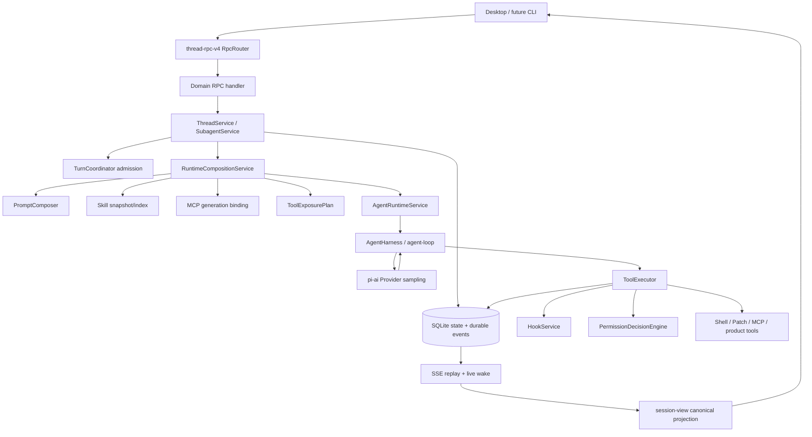

# OpenAI Codex Harness 对标与 CodePilotX Agent 优化决策报告

> **用途**：后续 Agent 优化的决策基线，不是源码搬运清单。
> **研究时点**：2026-08-22（Asia/Shanghai）。
> **CodePilotX 基线**：`733e308b528ba8796f517e4c0782559cbca6b51a`。
> **OpenAI Codex 基线**：`343074d4207d572809bd8cea15f4be1d09d98e0b`。
> **验证边界**：结论来自固定 SHA 的源码与测试静态审计；本轮未运行生产流量、故障注入或性能基准。“已实现”不等于“生产级验收通过”。

## 0. 执行摘要

CodePilotX 已经拥有自主维护的完整 Agent Harness，而不是模型 API 包装：真实多步 Agent Loop、持久化 Turn、工具权限链、compaction、交互恢复、Subagent、durable event 和 canonical projection 都已进入生产路径。

当前最有价值的工作不是迁移 Codex Rust，也不是继续堆工具，而是把**运行组合完整性、资源按需加载和长任务状态**做成可测、可恢复、可演进的产品能力。

### 0.1 严格执行顺序

1. **建立 Harness 指标与故障门禁**：没有 before/after，不接受“更快”“更稳”。
2. **补强 Runtime Composition 完整性**：校正 baseline、验证整体 hash、冻结工具 descriptor，并覆盖真实暂停/升级/损坏恢复。
3. **兑现 Skills/MCP 真按需**：普通 Turn 不读取全部 Skill 正文、不连接 optional MCP；在冻结声明范围内逐步激活。
4. **补齐 Hook 生命周期**：优先 `permission_request`、`pre_compact` 和统一 `stop`，避免声明支持但静默忽略。
5. **建设 Durable Goal**：把 objective、预算、状态、usage 和终止条件从自由文本提升为独立状态机。

### 0.2 优先级总览

| 顺序 | 主题 | 性质 | 用户价值 | 判断 |
|---|---|---|---|---|
| Gate 0 | Harness 指标与故障基线 | 验收基础 | 定位真实瓶颈、阻止无证据优化 | 立即建立 |
| P0-A | Runtime Composition 完整性 | 正确性/恢复 | 防止旧 Turn 以新工具或损坏快照继续 | 先于动态扩展 |
| P0-B | Skills/MCP 真按需 | 性能/可靠性/上下文 | 降首步延迟、I/O、连接和工具噪声 | 最高收益实现项 |
| P0-C | Hook 生命周期闭环 | 安全一致性 | 防止配置虚假生效 | 与 P0 串行 |
| Decision 1 | Sandbox ADR | 高风险架构 | 明确隔离承诺与拒绝条件 | 先决策与原型 |
| Decision 2 | 凭据治理 ADR | 安全治理 | 消除加密密文入库规则冲突 | 扩展前冻结 |
| P1-A | Durable Goal | 长任务能力 | 可预算、可恢复、可判定完成 | P0 后实施 |
| P1-B | Memory 召回质量 | 上下文质量 | 减少无关记忆与 token 污染 | 低成本先做 |
| P1-C | Tool 调度与 trace | 性能/诊断 | 找到等待、执行和屏障瓶颈 | 度量驱动 |

### 0.3 当前明确不做

- 不迁移或嵌入 `codex-rs/core`；吸收语义，不复制 Rust 架构。
- 不引入第二套 JSONL rollout/session store；SQLite state + durable event 继续作为真源。
- 不恢复 v3、双协议或客户端领域状态机。
- 不先做 Plugin SDK；composition、资源 identity、Sandbox 和凭据治理尚未稳定。
- 不凭感觉增加 read-barrier、event dispatcher/retention 或 projection 拆分；先证明问题。
- 不把当前 host 执行称为 Sandbox；OS 隔离必须经 Windows 攻击面验证。

---

## 1. 研究对象与证据规则

OpenAI 没有独立的 `codex-harness` 仓库。公开分析对象是 [`openai/codex`](https://github.com/openai/codex)：

- `codex-rs/core`：Agent Loop、Turn/Step、工具、compaction、MCP 和 execution logic。
- `codex-rs/app-server` / `app-server-protocol`：向 CLI、IDE、Desktop/Web 暴露 Harness。
- `codex-rs/thread-store`：canonical history、metadata projection、flush/fork 和 writer ownership。
- 其他 crate：sandbox、exec、hooks、skills、multi-agent 等支撑能力。

OpenAI 将 Harness 描述为支撑各 Codex 体验的 Agent Loop 与执行逻辑；核心 loop 编排用户、模型和工具。App Server 是双向客户端 API，不是另一套 Agent Loop。

- [Unrolling the Codex agent loop](https://openai.com/index/unrolling-the-codex-agent-loop/)
- [Unlocking the Codex harness](https://openai.com/index/unlocking-the-codex-harness/)
- [OpenAI Codex GitHub](https://github.com/openai/codex)

证据规则：

- 上游结论固定到 Codex `343074d4`；本地结论固定到 CodePilotX `733e308b`。
- 当前 Renderer/CHANGELOG dirty worktree 不作为 Harness 证据。
- “已实现”表示存在生产调用；“部分实现”表示基础设施存在但入口、契约或验收不完整。
- 性能假设必须经基准转为事实后再排期；外部 Agent 声明不代替源码、调用方和测试证据。

---

## 2. CodePilotX 当前 Harness 数据流



### 2.1 产品 Turn 的权威边界

1. `ThreadService` 在 admission gate 内验证输入、模型、附件和幂等键。
2. Turn、root Agent、输入、消息与初始 durable event 同事务提交。
3. 首个 Provider sampling 前，`RuntimeCompositionService` compose 或 rebind 持久化快照。
4. `AgentRuntimeService` 把冻结的 Prompt、模型、工具 exposure、Skills/MCP binding 交给 Harness。
5. Harness 在同一产品 Turn 内执行多个 sampling step；工具结果进入 history 后继续采样。
6. 工具统一经过 `ToolExecutor → PermissionDecisionEngine → Hook → handler`，用 `toolCallID` 幂等。
7. terminal、interaction checkpoint、compaction 和 event 按既有事务边界落库；SSE replay 后由 `session-view` 投影。

### 2.2 三类恢复不能合并

| 类型 | 真源 | 作用 |
|---|---|---|
| SSE cursor replay | durable events + sequence | 客户端断线补事件 |
| Interaction resume | approval/question/hook/subagent checkpoint lease | 从等待处恢复 Turn |
| Pi context reconstruction | Pi session entries + compaction retained tail | 重建模型可见 history |

旧报告候选 `ReplayCheckpoint` 会制造重复状态。正确方向是分别故障注入，并验证最终 Turn projection 一致。

---

## 3. 成熟能力与旧报告校正

| 能力 | 状态 | 必须保持的不变量 |
|---|---|---|
| Turn admission/terminal | 成熟 | 单 thread 一个 active Turn；短锁不覆盖长运行；终态幂等 |
| 多 sampling Agent Loop | 成熟 | 工具结果进入 history 后继续 sampling；截断参数 fail-closed |
| Runtime Composition v1/v2 | 已进生产 | fresh compose、resume rebind；resume 漂移 fail-closed |
| Prompt authority/cache | 成熟 | 系统规则与不可信 workspace context 分层；凭据 scrub |
| Tool/permission/idempotency | 成熟 | 所有 host 能力回到 ToolExecutor；hard gate 优先于审批 |
| Compaction | 成熟、待故障验收 | retained tail、provenance、usage 不被数组截断替代 |
| Durable event/SSE | 成熟 | 状态与 event 同事务；过滤事件后 cursor 仍前进 |
| Capability negotiation | 已完成 | connection 保存 client ∩ server；method/event 消费交集 |
| Hooks | 部分实现 | Hook 只能缩窄/拒绝/询问，不能扩大权限或 workspace |
| Subagent | 成熟基础 | 父权限 ceiling、容量限制、等待 checkpoint、requestId 幂等 |
| Forward compatibility | 成熟策略 | 高 schema 不降级；探测后广告能力 |

| 旧报告项目 | 当前状态 | 证据 | 新处理 |
|---|---|---|---|
| Capability 交集 P0 | 已完成 | `system.ts:113-120` | 移入不变量 |
| RuntimeCompositionPlan P0 | 已完成并持久化到 v2 | `types.ts:109-148`、`service.ts:57-104` | 只做完整性/验收 |
| 同 Turn 组合冻结 | 已完成 | `agent-harness.ts:379-455` | 补 descriptor 漂移测试 |
| Skill referenced identity | 已有基础 | Snapshot V2 | 真按需中复用 |
| Compaction retained tail | 已实现 | `pi-session/session.ts:59-78`、`compaction.ts:626-703` | 故障注入，不重建 DTO |
| Hook 系统 | 已存在、部分接线 | `HookService.ts:8-35,184-239` | 补声明/触发一致性 |
| SSE capability gate | 已完成 | `server.ts:125-193` | 保留回归 |

---

## 4. Codex 上游最值得吸收的机制

### 4.1 TurnContext + StepContext

Codex 每个 sampling step 只捕获一次 context，使 history、model-visible tool specs、dispatch binding 和 MCP view 一致；Turn 级模型会话跨 tool follow-up 复用。

- [`turn.rs:301-393`](https://github.com/openai/codex/blob/343074d4207d572809bd8cea15f4be1d09d98e0b/codex-rs/core/src/session/turn.rs#L301-L393)
- [`turn.rs:1312-1385`](https://github.com/openai/codex/blob/343074d4207d572809bd8cea15f4be1d09d98e0b/codex-rs/core/src/session/turn.rs#L1312-L1385)

CodePilotX 应让 outer `RuntimeCompositionPlan` 冻结允许范围，inner `StepCompositionSnapshot` 冻结本次 sampling 激活的 Skill/MCP/tool subset：同 Turn 可以按需激活，但单次采样绝不漂移。

### 4.2 Tool specs 与 dispatch 同源

Codex 用一个 router 同时持 runtime registry 与 model-visible specs；MCP、dynamic、core tools 统一组合后做 collision、deferred exposure 和 dispatch。

- [`spec_plan.rs:117-242`](https://github.com/openai/codex/blob/343074d4207d572809bd8cea15f4be1d09d98e0b/codex-rs/core/src/tools/spec_plan.rs#L117-L242)
- [`router.rs:68-204`](https://github.com/openai/codex/blob/343074d4207d572809bd8cea15f4be1d09d98e0b/codex-rs/core/src/tools/router.rs#L68-L204)

动态 MCP 工具仍进入现有统一链；命名碰撞 fail-closed，禁止 MCP 快车道。

### 4.3 读写门控并发与 timing

Codex parallel 工具取 read lock，串行工具取 write lock，并区分 queue/handler/total timing。

- [`parallel.rs:41-188`](https://github.com/openai/codex/blob/343074d4207d572809bd8cea15f4be1d09d98e0b/codex-rs/core/src/tools/parallel.rs#L41-L188)
- [`parallel.rs:263-345`](https://github.com/openai/codex/blob/343074d4207d572809bd8cea15f4be1d09d98e0b/codex-rs/core/src/tools/parallel.rs#L263-L345)

先记录现有 batch timing；只有证明 sequential 拖慢读工具或有交叉写冲突，才升级二值并发模型。

### 4.4 PolicyDecision 与 ExecutionPlan

Codex 把审批建模为 Skip/NeedsApproval/Forbidden，并收敛 sandbox、文件/网络 grant、cwd、env、retry；elevated 也不能抹掉 denied-read。

- [`sandboxing.rs:152-293`](https://github.com/openai/codex/blob/343074d4207d572809bd8cea15f4be1d09d98e0b/codex-rs/core/src/tools/sandboxing.rs#L152-L293)
- [`exec_policy.rs:274-535`](https://github.com/openai/codex/blob/343074d4207d572809bd8cea15f4be1d09d98e0b/codex-rs/core/src/exec_policy.rs#L274-L535)

先把“策略允许什么”和“OS 真正执行什么”分成可审计结构，再决定 Windows backend。

### 4.5 Compaction 是一等 checkpoint

Codex 区分 pre/mid-turn 插入位置，保留真实 user intent，校验远程压缩结果，并记录 before/after token、阶段和 fallback。

- [`compact.rs:59-217`](https://github.com/openai/codex/blob/343074d4207d572809bd8cea15f4be1d09d98e0b/codex-rs/core/src/compact.rs#L59-L217)
- [`compact.rs:528-711`](https://github.com/openai/codex/blob/343074d4207d572809bd8cea15f4be1d09d98e0b/codex-rs/core/src/compact.rs#L528-L711)

保留 CodePilotX retained tail 与 product event；补指标和故障注入，不复制多套路径。

### 4.6 Canonical history 与 projection 分权

Codex ThreadStore 只追加 canonical items；初始化使用 pending/commit/discard，持久真源先行，projection 可落后但不能领先。

- [`thread-store/README.md:4-28`](https://github.com/openai/codex/blob/343074d4207d572809bd8cea15f4be1d09d98e0b/codex-rs/thread-store/README.md#L4-L28)
- [`live_thread.rs:44-86`](https://github.com/openai/codex/blob/343074d4207d572809bd8cea15f4be1d09d98e0b/codex-rs/thread-store/src/live_thread.rs#L44-L86)

保留 SQLite 真源与事务 event，不迁移 JSONL；projection 只能从 durable source 重建。

### 4.7 MCP immutable binding

Codex 将 desired runtime 与当前 binding 分开；每 step pin binding，refresh 用 dirty/claim/publish 防半更新。

- [`core/src/mcp.rs:40-320`](https://github.com/openai/codex/blob/343074d4207d572809bd8cea15f4be1d09d98e0b/codex-rs/core/src/mcp.rs#L40-L320)
- [`session/mcp.rs:173-357`](https://github.com/openai/codex/blob/343074d4207d572809bd8cea15f4be1d09d98e0b/codex-rs/core/src/session/mcp.rs#L173-L357)

required MCP fail-fast；optional 只冻结声明，显式加载后原子发布下一 step binding；失败不能暴露半 catalog。

### 4.8 Root-scoped Subagent tree

Codex 每 root tree 共享容量；spawn 先 reserve，失败释放 slot；wait 用状态订阅，fork 读 durable frozen history。

- [`agent/control.rs:101-326`](https://github.com/openai/codex/blob/343074d4207d572809bd8cea15f4be1d09d98e0b/codex-rs/core/src/agent/control.rs#L101-L326)
- [`spawn.rs:403-473`](https://github.com/openai/codex/blob/343074d4207d572809bd8cea15f4be1d09d98e0b/codex-rs/core/src/agent/control/spawn.rs#L403-L473)

不重写现有 Subagent；先测 queue、slots、depth、delivery、orphan，再决定增强。

---

## 5. 证据化 Gap Register

### G0：缺统一优化基线

| 属性 | 结论 |
|---|---|
| 类型 | 验收基础缺口 |
| 影响 | 无法区分模型慢、Prompt 大、Skill I/O、MCP 启动、工具排队或 replay |
| 证据 | 已有 ExecutionLogObserver，但没有统一 Turn 指标和优化阈值 |
| 最小边界 | 结构化本地指标 + 固定 fixture，不建远程 telemetry |
| 完成标准 | 每个优化有 before/after；指标不含正文、凭据、命令环境和敏感路径 |

| 指标 | 定义 | 用途 |
|---|---|---|
| `turn_prepare_ms` | admission 到首次 provider request | 找启动瓶颈 |
| `prompt_tokens/tool_schema_bytes` | 每 step 的 Prompt 与工具体积 | 验证 context/deferred 收益 |
| `skill_index_reads/body_reads` | 索引与正文读取数 | 验证真按需 |
| `mcp_declared/connected/loaded` | 声明、连接、激活数 | 验证 optional 不连接 |
| `tool_queue/handler/total_ms` | 工具等待、执行、总时长 | 决定并发模型 |
| `resume_attempt/success/fail_reason` | 按 checkpoint 类型统计 | 定位恢复问题 |
| `duplicate_side_effect_count` | 同 toolCallID 重复副作用 | 必须恒为 0 |
| `projection_lag_ms` | commit 到客户端可见 | 决定是否需 dispatcher |
| `compaction_before/after_tokens` | 阶段、策略、前后 token | 衡量压缩质量 |

### G1：Composition 未冻结完整执行语义

| 属性 | 结论 |
|---|---|
| 类型 | Confirmed correctness gap |
| 影响 | 暂停/升级后旧 Turn 可能绑定同名新语义工具；损坏 hash 防护不完整 |
| 证据 | `types.ts:77-82` 只存工具名；`composer.ts:407-443` 只检查同名存在；baseline 字段和值不一致 |
| 最小实现 | 修 baseline、重算整体 hash、增加 descriptor fingerprint/behaviorVersion |
| 回滚 | 新 snapshot V3；旧 V1/V2 保持读取，不原地改写 |

```ts
interface ToolDescriptorSnapshot {
  readonly name: string
  readonly schemaHash: string
  readonly capabilityHash: string
  readonly allowedProfiles: readonly string[]
  readonly allowedModes: readonly string[]
  readonly approvalStrategy: string
  readonly executionMode: "parallel" | "sequential"
  readonly originIdentity: string
  readonly behaviorVersion: number
  readonly overallHash: string
}
```

不能对 handler 源码做不稳定 hash；实现语义无法自动表达时，由工具显式递增 `behaviorVersion`。MCP 工具 identity 包含冻结 server declaration 与 published binding。

必要验收：首 sample 前崩溃、同 Turn 多 step、同名工具 schema/权限/并发变化、快照篡改、高 schema 缺表 resume。所有不确定恢复必须返回安全的 `RUNTIME_COMPOSITION_UNAVAILABLE`，不能 fresh compose。

### G2：Skills 是工具 deferred，不是资源真按需

| 属性 | 结论 |
|---|---|
| 类型 | Confirmed performance/correctness gap |
| 影响 | Skill 增多放大每 Turn I/O、hash、Prompt metadata；坏 Skill 影响 catalog |
| 证据 | `ThreadService.ts:371,832`、`SubagentService.ts:501` 全量 `scan()`；`skill_search` 未注册 |
| 不变量 | 显式 `$skill` 定向读取；已引用变化阻塞恢复，未引用变化不阻塞 |
| 最小实现 | scan 只做索引刷新；Turn 热路径读取 metadata generation；注册 search/read |
| 完成标准 | 热缓存普通 Turn 正文读取为 0；100+ Skills 不产生线性正文 I/O |

```text
目录 watcher / 显式 refresh
  -> SkillIndexService（safe metadata + file identity）
Turn compose
  -> 冻结 index generation，不读正文
skill_search(query)
  -> 返回无绝对路径 metadata
skill_read(name)
  -> containment + UTF-8 + size + digest
  -> 记录 referenced {name, hash}
下一 step
  -> StepCompositionSnapshot 引用该 Skill
```

索引失效至少考虑 canonical root、相对路径、mtime、size、digest；坏文件给安全诊断，不静默吞掉。

### G3：Optional MCP 仍在 Turn 前连接

| 属性 | 结论 |
|---|---|
| 类型 | Confirmed startup/reliability gap |
| 影响 | 未使用 MCP 启动进程、网络/OAuth，并拖慢 Turn |
| 证据 | `acquire → ensure/reconcile` 连接全部 enabled；已有 list/load 但未注册 lifecycle tools |
| 不变量 | required fail-fast；optional 失败只影响显式加载；统一权限链 |
| 最小实现 | required eager、optional declaration-only；加载后原子发布 binding |
| 完成标准 | 10 个 optional 未使用时连接数 0；单 server 失败不污染 catalog |

```ts
interface FrozenResourceEnvelope {
  readonly skillIndexGeneration: string
  readonly mcpDeclarations: readonly {
    name: string
    required: boolean
    declarationHash: string
  }[]
}

interface StepCompositionSnapshot {
  readonly parentCompositionID: string
  readonly step: number
  readonly referencedSkills: readonly { name: string; hash: string }[]
  readonly mcpBindingHash: string
  readonly activeToolDescriptorHashes: readonly string[]
}
```

`mcp_load_server` 只能加载 outer envelope 已声明且 hash 一致的 server；加载后生成下一 step 快照，当前 sampling 不变。instructions 只有 loaded 后才进入后续 context。

### G4：Hook 声明与触发不一致

| 属性 | 结论 |
|---|---|
| 类型 | Confirmed safety/contract gap |
| 影响 | `permission_request`、`pre_compact` 配置可能被误认为生效 |
| 证据 | HookService 声明九类事件；未发现两者生产调用，Subagent stop 未走 Hook |
| 不变量 | Hook 不得扩大 input、权限、workspace、网络；ask 必须 durable |
| 最小实现 | 接两个缺失事件 + 统一 stop；不一次扩展全 Codex surface |
| 完成标准 | 每个公开 Hook 有生产测试；不支持的从 schema/config 移除 |

### G5：Shell 是 policy gate，不是 OS Sandbox

| 属性 | 结论 |
|---|---|
| 类型 | Architecture/security decision |
| 影响 | 当前用户权限下可访问宿主资源；错误文案会形成虚假安全预期 |
| 证据 | `system.ts:138-146` unsupported；`HostProcess.ts:159` 直接 spawn |
| 前置决策 | 哪些模式承诺隔离、backend 不可用是否拒绝、是否允许 host-unisolated |
| 当前动作 | ADR + Windows 原型 + 攻击面矩阵，不直接承诺 M 规模 |

最低矩阵：workspace 外读写、junction/symlink、子孙进程、网络、环境、凭据、进程树、超时、提升权限后 denied-read。预计 L/XL 高风险系统工程。

```ts
type PolicyDecision =
  | { kind: "allow"; grants: PermissionGrant[] }
  | { kind: "prompt"; request: ApprovalRequest }
  | { kind: "forbid"; code: string; safeReason: string }

interface ExecutionPlan {
  readonly isolation: "windows-restricted" | "host-unisolated"
  readonly filesystem: FileSystemGrant
  readonly network: NetworkGrant
  readonly cwd: string
  readonly environment: SanitizedEnvironment
}
```

请求强隔离而 backend 不可用时必须 forbid；只有策略明确允许时才能 host-unisolated。

### G6：凭据治理冲突

| 属性 | 结论 |
|---|---|
| 类型 | Governance decision |
| 影响 | MCP/Plugin/自动化不知道能否依赖 SQLite 可恢复密文 |
| 证据 | master key 在 Bun secrets；SQLite 保存 ciphertext/nonce；AGENTS.md 写凭据不得入 SQLite |
| 必须决策 | 规则是禁止明文，还是禁止任何可恢复密文 |
| 当前动作 | ADR 明确威胁模型、key 丢失、备份/迁移/删除/跨设备/日志 |

决策前不扩大 credential-dependent Plugin 或自动登录能力。

### G7：缺 Durable Goal

| 属性 | 结论 |
|---|---|
| 类型 | Product capability gap |
| 影响 | objective、预算、终止条件、blocked 只能依赖自由文本 |
| 证据 | Agent/protocol/shared/session-view 没有 Goal domain；compaction 只有文本标题 |
| 依赖 | Composition identity、真 lazy、恢复验收稳定 |
| 最小实现 | 独立表 + service + v4 capability/RPC/event + tools + projection |
| 完成标准 | 不因 compaction/restart 丢失；usage 原子；模型不能绕过 service |

```ts
interface DurableGoal {
  id: string
  threadID: string
  objective: string
  status: "active" | "complete" | "blocked"
  tokenBudget: number | null
  consumedTokens: number
  elapsedMs: number
  version: number
  createdAt: number
  updatedAt: number
  completedAt: number | null
}
```

建议 capability `goals.v1`；RPC `goal/create`、`goal/read`、`goal/update-status`；tools `create_goal`、`get_goal`、`update_goal`。每 Turn 只冻结 goal id/version；usage/status 由 service 事务更新。新表旧客户端可忽略，高 schema 按 capability probing 降级。

### G8：Memory recall 污染 Prompt

| 属性 | 结论 |
|---|---|
| 类型 | Confirmed quality/cost gap |
| 影响 | overlap=0 的最近 memory 也可能进入 context；最大 16k 字符 |
| 证据 | `MemoryService.ts:83-97` 是词集合 overlap + updatedAt，无最低阈值 |
| 最小实现 | overlap=0 不召回；FTS5/BM25；workspace/path/symbol 加权；预算 2k-4k |
| 完成标准 | 固定 query 的 precision@k 提升；零相关 recall 为 0；不先上向量服务 |

---

## 6. 决策完整的实施路线

### Gate 0：可重复基线

1. 复用 `ExecutionLogObserver/HarnessLogObserver`，新增安全 Turn 指标。
2. 固定 fixture：0/100/500 Skills；0/10 optional MCP；1 required MCP；多 tool batch；各 checkpoint；compaction；snapshot 损坏。
3. 只记录 count/bytes/duration/code/hash，不记录 Prompt、命令、环境、凭据或敏感路径。
4. 每阶段附 before/after，不建立远程 telemetry 依赖。

退出条件：基线可重复运行三次；能拆分 preparation/provider/tool/projection；duplicate side effect 恒为 0。

### Phase A：Runtime Composition 完整性

1. 新增 snapshot V3，不原地修改 V1/V2。
2. 校正 `activeTurnID`、`sessionEntryID/instructionSources`；不用的字段删除或明确填充，不能写假值。
3. 持久化 tool descriptor fingerprints。
4. rebind 重算分项、overall 和 identity hash。
5. 增加真实 Thread → AgentRuntimeService → Harness 故障测试。
6. 只有 V3 生产路径完整时才广告对应行为 capability。

退出条件：工具语义漂移拒绝恢复；损坏不 fresh compose；同 Turn 多 step outer identity 不变；旧 snapshot 保持既有兼容行为。

### Phase B：Skills 真按需

禁止只新增 `skill_search` API 而保留 Turn 热路径全量 `scan()`。

1. scan 改为显式索引刷新/缓存构建。
2. Turn 只读取 safe metadata index generation。
3. 注册 `skill_search`、`skill_read`；`skill_list` 仅在兼容需要时保留。
4. `$skill` 在首 sample 前定向 resolve；隐式使用走 search/read。
5. read 后写 referenced set，下一 step capture。
6. 移除 preview、main、Subagent eager body scan。
7. 补坏文件、UTF-8、size、containment、invalidation、安全诊断测试。

退出条件：普通 Turn body read=0；未引用 Skill 变化不阻塞、已引用变化 fail-closed；绝对路径不外泄。

### Phase C：Optional MCP 真按需

禁止只把工具标记 deferred，但仍连接所有 server。

1. required server connect，optional server declaration-only。
2. 注册 `mcp_list_servers`、`mcp_load_server`。
3. load 只能命中 outer snapshot 的冻结 declaration。
4. 构建 tool descriptors、collision/security 校验后原子 publish binding。
5. 下一 step capture 新 binding/active subset；当前 sampling 不变。
6. loaded 后才注入 instructions；OAuth/elicitation 走 durable interaction。
7. 旧 generation 等所有 lease 释放后清理。

退出条件：未使用 optional 不连接；required fail-fast；动态工具走统一权限链；旧 Turn 看不到创建后新增/修改的配置。

### Phase D：Hook 生命周期闭环

1. 审批 checkpoint 建立前接 `permission_request`。
2. manual/automatic/reactive compaction 共用入口接 `pre_compact`。
3. 主 Agent、Subagent、恢复取消统一触发 `stop`。
4. ask → durable interaction；deny → 安全错误；suggestion 不提升权限。
5. 对外 schema 只保留真实接通的事件。

退出条件：每个公开 Hook event 都有生产路径测试；Hook 不扩大边界；重启后可继续或安全取消。

### Decision Lane：Sandbox 与凭据

1. Sandbox ADR 锁定产品承诺、威胁模型、fail-closed、host 文案和 backend 候选。
2. 原型验证受限 Token/AppContainer/Windows Sandbox 对 junction、子进程、网络和进程树终止的真实效果。
3. 凭据 ADR 明确 SQLite ciphertext 是否合规，以及 key 丢失、备份、迁移、删除、跨设备、日志策略。
4. ADR 通过前，不扩大 Plugin SDK 或隐式 credential-dependent 自动化。

### Phase E：Durable Goal

1. 新增独立 goal 表/repository，不破坏核心表。
2. service 状态机、乐观版本和 complete/blocked 规则。
3. v4 method/event/capability 与 session-view projection。
4. lifecycle tools 只调用 service，不直接写 SQL。
5. provider usage 原子累计，elapsed 由 service 计算。
6. compaction 从 durable goal 注入，不从自由文本猜测。
7. Subagent 只能报告/建议，不能越权修改父 Goal。

退出条件：Goal 可 replay、恢复、预算和完成判定；高 schema 缺表不广告；旧客户端可忽略。

### Phase F：数据驱动的质量优化

- Memory：先 FTS5/BM25、阈值、预算，不先引入 embedding 服务。
- Tool concurrency：先 timing，再决定读写 gate。
- Event dispatcher：只有 projection lag/遗漏证据才收敛手工 publish。
- Event retention：只有库增长/查询证据才做 GC，且保护活跃 cursor。
- Subagent：先测 queue/capacity/delivery/orphan，再增强 reservation/子树恢复。

---

## 7. 必要测试与验收矩阵

只写保护本次行为的必要测试，不新增大面积快照。

| 领域 | 必测场景 | 断言 |
|---|---|---|
| Composition | fresh、multi-step、resume、corruption、descriptor drift | 首 sample 前持久化；不重组；漂移 fail-closed |
| Skills | index/search/read/显式引用/坏文件/变化 | 普通 Turn 不读正文；reference hash 正确 |
| MCP | required/optional/load/OAuth/generation | optional 未用不连接；binding 原子 |
| Hooks | 公开 event、trust、ask/deny/narrow/crash | 无静默未接线；不提权 |
| Recovery | running、各 wait、side effect、compaction | 可恢复项继续；模糊副作用 interrupted |
| Goal | CRUD、budget、usage、compaction、replay | 状态/usage 原子；旧客户端可忽略 |
| Projection | durable/live/replay/history | error/wait/compaction/Goal 一致 |
| Sandbox | 外读写、junction、child、network、env、timeout | 隔离必需而 backend 不可用时拒绝 |

验证顺序：

```powershell
bun run --cwd apps/agent typecheck
bun run --cwd apps/agent test
bun run --cwd packages/agent-protocol typecheck
bun run --cwd packages/session-view typecheck
bun run typecheck
bun run build:agent
git diff --check
```

跨 RPC/event/projection 再验证消费者和 renderer build；只有打包变化才运行 `package:win`。

---

## 8. 量化门槛

以下是首轮目标，不是当前性能声明；Gate 0 后按基线调整。

| 目标 | 建议门槛 |
|---|---|
| Skills | 普通 Turn `skill_body_reads=0`；显式引用数等于读取数 |
| Optional MCP | 未显式加载时 `connected_optional=0` |
| Tool schema | 大 catalog 首次 schema bytes 明显下降，工具成功率不降 |
| Composition | descriptor drift/corruption 100% fail-closed |
| Side effect | 所有故障 fixture 重复副作用恒为 0 |
| Recovery | 可恢复 checkpoint 成功率 100%；模糊副作用明确 interrupted |
| Hook | 对外声明事件生产触发覆盖率 100% |
| Memory | precision@k 提升；零相关 recall=0；注入字符下降 |
| Projection | 重连 canonical state 与直接 history snapshot 一致 |
| 诊断 | log/event/error 无 key、完整命令环境、敏感绝对路径 |

不设“代码行数减少”或“与 Codex 目录一致”等无用户价值指标。

---

## 9. 非目标与兼容约束

1. 不迁移 Codex Rust。
2. 不引入 JSONL 第二真源。
3. 不恢复 v3；新能力只进 v4，以 capability/可选字段演进。
4. 不复制上游多版本债务。
5. 不复制跨平台 Sandbox crate 层级，只吸收 fail-closed/单 execution plan。
6. 不绕过 ToolExecutor。
7. Skill/MCP/Hook/Plugin 保持独立边界。
8. Plugin SDK 晚于 composition V3、真 lazy、Sandbox/凭据 ADR。
9. 新功能优先独立表；高 schema 不降级、不清库、不改未知数据。
10. 只写冻结新行为与故障边界的必要测试。

---

## 10. 后续任务拆分规则

每阶段拆成 30-60 分钟内可闭环的小任务，尤其是外部 Coding Agent：

1. 一次一个行为、1-3 个生产文件、1-2 个必要测试。
2. 先记录 HEAD、dirty、暂存区和受保护文件 hash。
3. 先冻结行为测试；禁止删测、弱化断言、两个 Turn 替代单 Turn 多 step。
4. 外部 Agent 不决定 schema、Sandbox、凭据或 fail-closed 策略。
5. 主 Agent 独立检查 diff、调用方、测试、typecheck/build、`git diff --check`。
6. 同一缺陷三轮未修复即停止消耗，保留证据。

建议第一批任务：

1. 只新增 Gate 0 指标 fixture，不改执行行为。
2. 修 `activeTurnID` 与整体 hash 验证。
3. 增加 tool descriptor fingerprint 与 drift 测试。
4. 建 Skill metadata index，证明热路径不读正文。
5. 注册 `skill_search/read`，逐入口移除 eager scan。
6. Optional MCP 改为 declaration-only。
7. 注册 MCP load tools并接 step binding。
8. 依次补 `permission_request`、`pre_compact`、统一 stop。

---

## 11. 证据索引

### 11.1 CodePilotX HEAD `733e308b`

| 机制/缺口 | 关键位置 |
|---|---|
| Capability | `transport/rpc/handlers/system.ts:113-120` |
| Runtime Composition | `runtime-composition/types.ts:109-148`、`service.ts:57-104` |
| 生产接入 | `orchestration/AgentRuntimeService.ts:849-950` |
| Agent Loop | `orchestration/harness/agent-loop.ts:156-275,412-605` |
| Tool/Permission | `tool/ToolExecutor.ts:120-217,295-489`、`permission/PermissionDecisionEngine.ts:52-100` |
| Skills eager | `session/ThreadService.ts:371,832`、`subagent/SubagentService.ts:501` |
| MCP eager | `mcp/McpConnectionManager.ts:188-280,327-392` |
| Hooks | `hooks/HookService.ts:8-35,184-239` |
| Resume | `interaction/ResumeCheckpointResolver.ts:31-158` |
| Compaction | `context/harness/compaction.ts:626-703` |
| Pi context | `storage/pi-session/session.ts:59-78,184-189` |
| SSE replay | `transport/server.ts:521-647` |
| Canonical view | `packages/session-view/src/canonical/index.ts:44-68,580-690` |
| Memory | `memory/MemoryService.ts:83-97` |
| Host exec | `transport/rpc/handlers/system.ts:138-146`、`tool/Shell/HostProcess.ts:159` |

### 11.2 OpenAI Codex SHA `343074d4`

| 机制 | 固定源码 |
|---|---|
| Agent Turn/Step | [`turn.rs`](https://github.com/openai/codex/blob/343074d4207d572809bd8cea15f4be1d09d98e0b/codex-rs/core/src/session/turn.rs) |
| Tool plan/router | [`spec_plan.rs`](https://github.com/openai/codex/blob/343074d4207d572809bd8cea15f4be1d09d98e0b/codex-rs/core/src/tools/spec_plan.rs)、[`router.rs`](https://github.com/openai/codex/blob/343074d4207d572809bd8cea15f4be1d09d98e0b/codex-rs/core/src/tools/router.rs) |
| Concurrency | [`parallel.rs`](https://github.com/openai/codex/blob/343074d4207d572809bd8cea15f4be1d09d98e0b/codex-rs/core/src/tools/parallel.rs) |
| Approval/Sandbox | [`sandboxing.rs`](https://github.com/openai/codex/blob/343074d4207d572809bd8cea15f4be1d09d98e0b/codex-rs/core/src/tools/sandboxing.rs) |
| Compaction | [`compact.rs`](https://github.com/openai/codex/blob/343074d4207d572809bd8cea15f4be1d09d98e0b/codex-rs/core/src/compact.rs) |
| Thread store | [`thread-store`](https://github.com/openai/codex/tree/343074d4207d572809bd8cea15f4be1d09d98e0b/codex-rs/thread-store) |
| MCP | [`mcp.rs`](https://github.com/openai/codex/blob/343074d4207d572809bd8cea15f4be1d09d98e0b/codex-rs/core/src/mcp.rs) |
| Hooks | [`hook_runtime.rs`](https://github.com/openai/codex/blob/343074d4207d572809bd8cea15f4be1d09d98e0b/codex-rs/core/src/hook_runtime.rs) |
| Multi-agent | [`agent/control.rs`](https://github.com/openai/codex/blob/343074d4207d572809bd8cea15f4be1d09d98e0b/codex-rs/core/src/agent/control.rs) |
| App Server | [`app-server/README.md`](https://github.com/openai/codex/blob/343074d4207d572809bd8cea15f4be1d09d98e0b/codex-rs/app-server/README.md) |

---

## 12. 最终决策

后续 Agent 优化统一遵循：

> **先测量 → 冻结执行语义 → 真正按需加载 → 补齐 Hook → 建设 Goal → 用数据决定 Memory、并发、event 与 Plugin。**

如果资源只允许三件事：

1. Runtime Composition V3 完整性与生产故障验收；
2. Skills/MCP 真按需加载；
3. Durable Goal 与预算状态机。

Sandbox 与凭据是并行架构决策 lane；ADR 未明确前，禁止扩大安全承诺和第三方扩展面。
