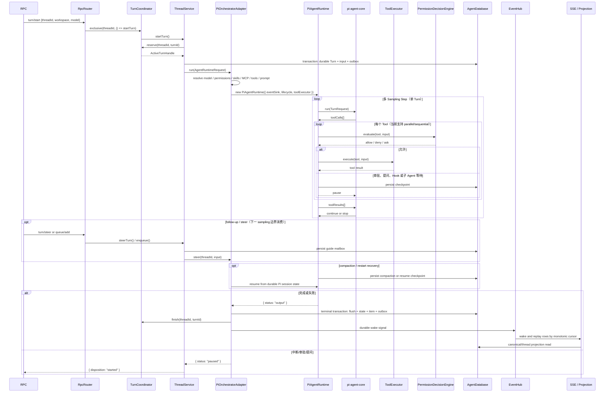
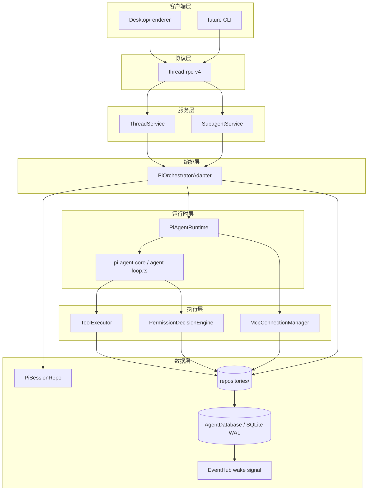

# Codex Harness 对标与 CodePilotX Agent 优化研究报告

> **时效声明**：本报告为时点研究，基于 `1182b4b1` 与 Codex `536f86e5`。非绑定架构契约；OpenAI 公开仓库不代表内部服务端全部实现；"未发现"不等于绝对不存在；旧计划（61a44880）不作证据。

## 执行摘要

### 核心结论

CodePilotX 已实现完整 TypeScript/Bun Agent Harness，核心语义（Turn 生命周期、事务性持久化、SSE Replay、Checkpoint/Compaction、Tool 暴露、子 Agent 编排）与 Codex 基本对齐。三处 P0 需优先解决。

### 已成熟能力（8-12 项）

Turn 生命周期管理（TurnCoordinator 串行 gate）；SQLite WAL + 外键 + busy timeout；EventHub 区分 live/durable，事务 outbox row 是 durable source of truth；Checkpoint lease；ContextCompactionService；ToolExposurePlan eager/deferred/exposed 三集；MCP generation lease；SubagentService spawn/wait/stop；PermissionDecisionEngine；Pi Session 持久化；thread.handoff/fork capability；EncryptedCredentialRepository（凭据加密存储）；Electron sidecar。

### Top 10

Capability 协商交集（Bug）、RuntimeCompositionPlan 快照、Windows Sandbox Contract、MCP elicitation/negotiation、ReplayCheckpoint 增强、canonical prompt projection、ToolConcurrencyClass（read-barrier/exclusive 语义）、DurableEventDispatcher、SSE monotonic notifier、Skill identity/snapshot。

### P0 立即开始

1. **P0-1**（Bug）：system.ts initialize 将 `new Set(params.capabilities)` 原样存入 connection，未做 clientRequested ∩ serverAvailable 交集；现有 method gate 已正确消费 `connection.capabilities`（RpcRouter.ts:347），修复点是将 connection state 改为存 negotiated set
2. **P0-2**（架构债）：RuntimeCompositionPlan 接口草案
3. **P0-3**（能力缺口）：SandboxBackend 接口草案

### 暂不开始

不迁移 Codex Rust；不引入第二 session store/rollout JSONL；不恢复 v3 协议；Plugin SDK 在 RuntimeCompositionPlan 稳定前禁做。

### P0/P1/P2

- P0：Capability 协商交集（Bug）、RuntimeCompositionPlan（架构债）、Windows Sandbox（能力缺口）
- P1：MCP/Skill/Durable Goal/ReplayCheckpoint/canonical/Turn trace/ToolConcurrency/DurableEvent/SSE/ThreadReadModel/模块拆分
- P2：Plugin SDK

### Codex 迁移结论

**不迁移。** CodePilotX 是 TypeScript/Bun monorepo；迁移结论仅基于公开 codex-rs 边界，不代表内部服务端。

---

## 一、研究范围与事实边界

| 属性 | 值 |
|---|---|
| CodePilotX HEAD | `1182b4b11943aa450d8ec43c8ab7c7381c426b35` |
| Codex 固定 SHA | `536f86e5cc9ec1ff38457d099bf320b9d08eeeba` |
| 研究日期 | 2026-08-21 |
| Codex 官方 | [Harness](https://openai.com/index/unlocking-the-codex-harness/)、[Agent Loop](https://openai.com/index/unrolling-the-codex-agent-loop/) |
| 本地克隆路径 | `codex-rs/core/src/`、`codex-rs/thread-store/src/` |

**边界**：研究重点是公开 codex-rs Harness，不涉及 Codex 内部服务端；迁移结论仅基于公开边界；执行期间的 working-tree 修改不作为 HEAD 证据；旧计划（61a44880）不作证据。OpenAI 源码事实与 CodePilotX 工程建议在下文分别标注。

---

## 二、当前 Harness 架构

### 2.1 Turn 生命周期完整数据流



### 2.2 静态分层架构



| Composition 方面 | 主 Agent | 子 Agent | 当前问题 |
|---|---|---|---|
| 共用输入 | model、workspace、permissionConfig、Skills、MCP lease、tool exposure、prompt/context | 同左 | 两条入口最终都把分散参数交给 `PiOrchestratorAdapter` 二次推导 |
| 保留差异 | `main` profile、用户 Turn、queue 与 steer | `default`/`explorer`/`worker` profile、独立 child thread/session、shared/worktree 策略 | 差异应成为 compose 输入，而不是复制一套 composition |
| 目标边界 | `ThreadService` 与 `SubagentService` 调用同一个 `RuntimeCompositionService.compose()` | 同左 | 目标服务当前不存在；应由 P0-2 新增，不能在当前图中冒充已实现 |

---

## 三、已实现且必须保留的能力

必须保留：唯一 typed `thread-rpc-v4`、initialize 与现有 method capability gate；TurnCoordinator 串行 gate 和唯一 terminalize；start/steer/follow-up；SQLite WAL、外键、busy timeout 与高版本 schema capability probing；**事务内 durable event/outbox row 作为 source of truth**；EventHub wake、SSE cursor replay/ack、事件时快照、canonical/thread projection；approval/question/hook/subagent wait checkpoint；toolCallID 幂等和副作用恢复；MCP generation lease；Skills 扫描、shadowing、containment；manual/automatic/reactive compaction；持久化 Subagent Task/Run/Turn/Workspace；ToolExposurePlan、PermissionDecisionEngine、handoff/fork、Provider 边界与 Electron sidecar generation/instance token/退出流程。`EncryptedCredentialRepository`（`bootstrap.ts:318`）存加密密文，与“API key 不得写 SQLite”存在治理冲突，仅待决策。

---

## 四、Codex 高价值机制对照

> 所有 permalink 基于本地克隆 `codex-rs/` 路径；SHA `536f86e5cc9ec1ff38457d099bf320b9d08eeeba`。

| # | 上游机制 | 固定 SHA 链接 | CPX 等价 | 差距 | 吸收 | 不复制 |
|---|---|---|---|---|---|---|
| 1 | TurnContext 不可变上下文 | [`turn_context.rs:142`](https://github.com/openai/codex/blob/536f86e5cc9ec1ff38457d099bf320b9d08eeeba/codex-rs/core/src/session/turn_context.rs#L142) | `PiRuntimeEventContext` per-event | 无统一不可变快照 | 待验证 | 不等于 per-step 重配 |
| 2 | 单 Turn 多 sampling step | [`turn_context.rs`](https://github.com/openai/codex/blob/536f86e5cc9ec1ff38457d099bf320b9d08eeeba/codex-rs/core/src/session/turn_context.rs) | PiAgentRuntime 循环 | 基本对齐 | 是 | — |
| 3 | steer/mailbox phase | [`input_queue.rs:17`](https://github.com/openai/codex/blob/536f86e5cc9ec1ff38457d099bf320b9d08eeeba/codex-rs/core/src/session/input_queue.rs#L17) | `guideMailbox` 未分型 | 部分对齐 | 待验证 | CPX 用 TurnCoordinator |
| 4 | canonical history 与 model-visible prompt 分离 | [`turn_context.rs`](https://github.com/openai/codex/blob/536f86e5cc9ec1ff38457d099bf320b9d08eeeba/codex-rs/core/src/session/turn_context.rs) | `ThreadReadViewRepository` 投影 | 部分对齐 | 待验证 | 投影逻辑分散 |
| 5 | registered/callable/advertised tools 分离 | [`registry.rs`](https://github.com/openai/codex/blob/536f86e5cc9ec1ff38457d099bf320b9d08eeeba/codex-rs/core/src/tools/registry.rs) | `eager/deferred/exposed` 三集 | 部分对齐 | 部分 | 三集语义不同 |
| 6 | deferred tools（独立于 registered/advertised） | [`registry.rs`](https://github.com/openai/codex/blob/536f86e5cc9ec1ff38457d099bf320b9d08eeeba/codex-rs/core/src/tools/registry.rs) | `ToolExposurePlan.deferred` | 部分对齐 | 部分 | 暴露机制有差异 |
| 7 | per-tool concurrency class | [`parallel.rs:113`](https://github.com/openai/codex/blob/536f86e5cc9ec1ff38457d099bf320b9d08eeeba/codex-rs/core/src/tools/parallel.rs#L113)、[`registry.rs:470`](https://github.com/openai/codex/blob/536f86e5cc9ec1ff38457d099bf320b9d08eeeba/codex-rs/core/src/tools/registry.rs#L470) | `agent-loop.ts:411-449` 有 parallel/sequential 二值 | 缺 read-barrier/exclusive | 吸收三类语义 | 复用现有并发路径 |
| 8 | ToolOrchestrator policy/approval/sandbox/network/retry | [`session.rs:187`](https://github.com/openai/codex/blob/536f86e5cc9ec1ff38457d099bf320b9d08eeeba/codex-rs/core/src/session/session.rs#L187) | `PermissionDecisionEngine`+`SandboxMode` | sandbox 边界模糊，network/retry 未分离 | 部分 | 当前是 policy gate |
| 9 | compaction: replacement history + window lineage | [`compact.rs:55`](https://github.com/openai/codex/blob/536f86e5cc9ec1ff38457d099bf320b9d08eeeba/codex-rs/core/src/compact.rs#L55) | `ContextCompactionService` 统一策略 | 未区分 replacement history 和 window lineage | 待验证 | — |
| 10 | append-only rollout + flush fence + metadata projection | [`rollout.rs`](https://github.com/openai/codex/blob/536f86e5cc9ec1ff38457d099bf320b9d08eeeba/codex-rs/core/src/rollout.rs)（具体 fence/projection 待验证） | SQLite transaction + outbox + projection | 介质不同；缺统一 dispatcher/trace 投影 | 吸收语义 | 不复制 JSONL |
| 11 | checkpoint 逆向查找 + surviving tail 正向回放 | [`session/mod.rs`](https://github.com/openai/codex/blob/536f86e5cc9ec1ff38457d099bf320b9d08eeeba/codex-rs/core/src/session/mod.rs)（具体算法位置待验证） | `ResumeCheckpointResolver` + Pi session | 缺显式 replacement/lineage/tail 契约 | 值得吸收 | 不复制 Rust 锁结构 |
| 12 | MCP immutable published binding | [`step_context.rs`](https://github.com/openai/codex/blob/536f86e5cc9ec1ff38457d099bf320b9d08eeeba/codex-rs/core/src/session/step_context.rs) | `McpTurnLease` per-turn | **未发现** immutable binding 语义 | 否 | generation lease 不等于 immutable |
| 13 | required/optional MCP readiness | [`mcp.rs`](https://github.com/openai/codex/blob/536f86e5cc9ec1ff38457d099bf320b9d08eeeba/codex-rs/core/src/mcp.rs) | — | **未发现** required/optional 区分 | 否 | — |
| 14 | Skill root/identity/snapshot/cache/依赖 admission | [`skills.rs`](https://github.com/openai/codex/blob/536f86e5cc9ec1ff38457d099bf320b9d08eeeba/codex-rs/core/src/skills.rs) | `SkillService`+`lifecycle.skillList` | 部分实现 identity/snapshot，缺 cache/dependency admission | 部分 | — |
| 15 | Hook DTO/timeout/cancellation/safe drain | [`hook_runtime.rs`](https://github.com/openai/codex/blob/536f86e5cc9ec1ff38457d099bf320b9d08eeeba/codex-rs/core/src/hook_runtime.rs) | — | **未发现** Hook 系统 | 否 | 独立职责边界 |
| 16 | root-session scoped Subagent graph | [`session.rs`](https://github.com/openai/codex/blob/536f86e5cc9ec1ff38457d099bf320b9d08eeeba/codex-rs/core/src/session/session.rs) | `SubagentService` | 部分实现，无 graph 语义 | 部分 | — |
| 17 | spawn reservation + fork retention policy | [`store.rs:161`](https://github.com/openai/codex/blob/536f86e5cc9ec1ff38457d099bf320b9d08eeeba/codex-rs/thread-store/src/store.rs#L161)（prepare_fork Unsupported） | `SubagentService` worktree* | **未发现** 明确 reservation/retention 语义 | 否 | — |
| 18 | Thread/Turn/Item typed lifecycle | [`session.rs`](https://github.com/openai/codex/blob/536f86e5cc9ec1ff38457d099bf320b9d08eeeba/codex-rs/core/src/session/session.rs) | Item 类型已有 | 部分对齐，typed lifecycle 事件不完整 | 部分 | — |

---

## 五、十二维能力矩阵

| 维度 | Codex 机制 | CPX 现状 | 评级 |
|---|---|---|---|
| **1. Turn/Step composition** | TurnContext 不可变 + StepContext per-sampling | 整个 Turn 相同 composition，无统一快照 | 明显缺口 |
| **2. Agent loop 与 steer/mailbox** | InputQueue 区分 Mailbox/Steer | guideMailbox 未分型 | 部分对齐 |
| **3. Canonical history 与 prompt projection** | canonical history 与 model-visible prompt 分离 | ThreadReadViewRepository 投影存在 | 部分对齐 |
| **4. Compaction/checkpoint/replay** | InitialContextInjection；checkpoint 逆向查找+surviving tail | ContextCompactionService 统一策略；checkpoint 对齐不完整 | 部分对齐 |
| **5. Tool catalog/exposure/deferred/concurrency** | ToolRegistry+ToolRouter；parallel/read-barrier/exclusive | ToolExposurePlan 三集已有；agent-loop.ts 有 parallel/sequential 二值；缺 read-barrier/exclusive | 部分对齐 |
| **6. Permission/approval/sandbox/network** | SandboxPolicy；PermissionProfile；network/retry | PermissionDecisionEngine+SandboxMode；policy gate 非强隔离；network/retry 未分离 | 部分对齐 |
| **7. Persistence/outbox/recovery/projection** | append-only rollout+durable event+flush fence | 事务 outbox row 是 source of truth；EventHub 发 live/durable wake；WAL+SQLite transaction | 基本对齐 |
| **8. MCP/Skills/Hooks/Plugins** | MCP immutable binding；Skills；Hooks；Plugin SDK | MCP generation lease；Skill 部分；无 Hook；Plugin 待 P2 | 部分对齐 |
| **9. Subagent graph/capacity/fork/recovery** | Subagent graph；spawn reservation；fork retention | SubagentService spawn/wait/stop 已有；worktree* 存在；无 graph/reservation | 部分对齐 |
| **10. RPC capability 与 lifecycle** | method gate + capability filtering | RpcRouter.ts:347 已有 method gate；Bug 在 system.ts 存 raw set | 部分对齐 |
| **11. Observability/diagnostics/performance** | Rollout trace+TurnMetadataState | TurnCoordinator+EventHub 日志；无专门 performance metrics | 部分对齐 |
| **12. Schema/protocol/forward compatibility** | ThreadStore trait+schema versioning | AgentDatabase schema+WAL+外键 | 基本对齐 |

---

## 六、优化路线图

### 路线图总表

| ID | 状态 | 类型 | 当前证据 / 上游机制 | 用户价值 | 风险 | 目标设计 | 依赖 | 规模 | 优先级 | 验收 |
|---|---|---|---|---|---|---|---|---|---|---|
| **P0-1** | 部分实现 | Bug | E1；上游 capability gate | 消除协议缺口 | 中 | connection 存 client ∩ server | 无 | M | P0 | method/event/connection 只见交集 |
| **P0-2** | 未发现 | 架构债 | E2；上游 Turn/StepContext | 稳定恢复基准 | 中：snapshot 迁移/versioning | compose() → frozen plan → runtime/step snapshot | 无 | M | P0 | 兼容读取、双写/回填和故障恢复 |
| **P0-3** | 部分实现 | 能力缺口 | E3；上游 SandboxPolicy | 强隔离边界 | 高：错误 fallback | SandboxBackend + 验证矩阵 | 无 | M | P0 | 真实进程故障注入；隔离必需时 fail-closed |
| **P1-A** | 部分实现 | 能力缺口 | E4；上游 readiness/elicitation | 完整 MCP lifecycle | 中 | prompts/elicitation/roots/negotiation | P0-2 | M | P1 | required 失败、optional 降级、elicitation 恢复 |
| **P1-B** | 部分实现 | 能力缺口 | E4；上游 identity/snapshot/cache | 精确版本追踪 | 中 | SkillSnapshot + dependency admission | P0-2 | M | P1 | 内容变化产生新 digest；依赖缺失拒绝准入 |
| **P1-C** | 未发现 | 能力缺口 | E8；上游公开机制待验证 | 跨 Turn 目标 | 高 | Goal/step/status/event/recovery ADR | P0-2 | L | P1 | 重启恢复；完成事件幂等；旧客户端可忽略 |
| **P1-D** | 部分实现 | 能力缺口 | E5；上游 checkpoint/tail | 确定性恢复 | 中 | ReplayCheckpoint + 逆向查找/正向回放 | P0-2 | M | P1 | 中断注入、tail 顺序、重复副作用防护 |
| **P1-E** | 部分实现 | 能力缺口 | E5/E6；上游 history/prompt 分离 | 可复现 prompt | 中 | canonical 与 provider projection 分离 | P0-2 | M | P1 | 相同 checkpoint 重建相同 prompt |
| **P1-F** | 部分实现 | 能力缺口 | E6；上游 rollout metadata | 可诊断性 | 低 | Turn trace + 本地指标 | 无 | S | P1 | trace 可查询且不含敏感信息 |
| **P1-G** | 部分实现 | 能力缺口 | E7；上游 parallel gate | 安全并发 | 中 | parallel/read-barrier/exclusive | P0-2 | M | P1 | 并发、屏障、互斥故障注入 |
| **P1-H** | 部分实现 | 架构债 | E6；上游 rollout | 统一幂等分发 | 中 | DurableEventDispatcher | 无 | M | P1 | 重复 dispatch 不双写；重启可续投 |
| **P1-I** | 部分实现 | 性能风险 | E6；上游 rollout wake | 无漏通知 | 待压测 | monotonic notifier | 无 | S | P1 | missed wake/reconnect/慢消费者压测 |
| **P1-J** | 待验证 | 性能风险 | E6；未发现 retention/GC | 控制表增长/查询成本 | 不得称泄漏 | cursor/ack/age retention | 无 | M | P1 | 活跃 cursor 安全；过期行可回收 |
| **P1-K** | 部分实现 | 架构债 | E6；上游 metadata projection | schema 演进 | 中 | `ThreadReadModelRepository` + `EventProjectionMapper` | 无 | M | P1 | 投影重建与现有快照一致 |
| **P1-L** | 部分实现 | 架构债 | E2/E6 | 降低变更耦合 | 中 | 按领域渐进拆分 | P0-2 | L | P1 | 行为测试不变；无跨层 SQL 回流 |
| **P1-M** | 部分实现 | 能力缺口 | E7；上游 registry | 可审计工具决策 | 中 | registered/callable/advertised + 统一 Tool decision record | P0-2 | M | P1 | 三集合正确；决策记录可追踪 |
| **P2-A** | 未发现 | 能力缺口 | E8/E2 | 第三方扩展 | 高 | immutable/disabled/declarative/capability-gated SDK | P0-2、MCP/Skill identity | XL | P2 | 默认禁用；无脚本/在线依赖/敏感信息暴露 |

### P0-1 接口草案

```typescript
// connection state 中存储 negotiated capabilities（权威来源）
type NegotiatedCapabilities = ReadonlySet<RpcCapability>
const serverAvailable = filterAdvertisedCapabilities(db)
const negotiated = intersection(clientRequested, serverAvailable)
connection.capabilities = negotiated  // 覆盖 initialize 时存入的 raw set
// 现有 method gate（RpcRouter.ts:347）：connection.capabilities.has(capability)
// 现有 event subscription：消费 connection.capabilities
// RuntimeCompositionPlan 可快照运行时需要的子集（不是权威来源）
```

### P0-2 接口草案

```typescript
// 拟新增：packages/pi-agent-core/src/harness/runtime-composition.ts
interface RuntimeCompositionPlan {
  readonly identity: RuntimeCompositionIdentity
  readonly model: ResolvedModelSnapshot
  readonly workspace: RuntimeWorkspaceScope
  readonly permissions: PermissionPlan
  readonly skills: SkillSnapshot
  readonly mcp: McpGenerationBinding
  readonly tools: ToolExposurePlan
  readonly prompt: PromptBundle
  readonly context: ContextBaseline
  readonly capabilities: ReadonlySet<RuntimeCapability>
  readonly hashes: CompositionHashes
}
```

### P0-3 验证矩阵

```typescript
interface SandboxBackend {
  readonly id: string
  readonly capabilities: SandboxCapabilities
  prepare(policy: ExecutionPolicy): Promise<SandboxExecutionPlan>
  spawn(plan: SandboxExecutionPlan): Promise<SandboxedProcess>
  terminateTree(process: SandboxedProcess): Promise<void>
}
```

| 验证场景 | AppContainer | 受限 Token | Windows Sandbox | host-unisolated（backend 不可用时） |
|---|---|---|---|---|
| workspace 外读 | TBD | TBD | TBD | fail-closed |
| workspace 外写 | TBD | TBD | TBD | fail-closed |
| junction/symlink | TBD | TBD | TBD | fail-closed |
| 子进程 | TBD | TBD | TBD | fail-closed |
| 孙进程 | TBD | TBD | TBD | fail-closed |
| 网络 | TBD | TBD | TBD | fail-closed |
| 环境变量 | TBD | TBD | TBD | fail-closed |
| 凭据访问 | TBD | TBD | TBD | fail-closed |
| timeout/进程树清理 | TBD | TBD | TBD | fail-closed |

`host-unisolated` 只能在策略明确允许宿主执行时作为可审计模式；请求强隔离而 backend 不可用时必须 fail-closed，不得静默降级。

### P1-G 接口草案

```typescript
// 拟新增：apps/agent/src/tool/ToolConcurrencyClass.ts
type ToolConcurrencyClass =
  | "parallel"     // 无限制并发
  | "read-barrier" // 任何写操作前等待该工具所有实例完成
  | "exclusive"    // 互斥，同时只允许一个实例
```

### P1-D ReplayCheckpoint 接口草案

```typescript
interface ReplayCheckpoint {
  checkpointId: string
  sourceEventCursor: number
  replacementHistoryRef: string
  contextWindowId: string
  parentWindowId: string | null
  worldBaseline: WorldStateBaseline
  compositionBaseline: CompositionBaseline
  resourceProvenance: ResourceProvenance[]
}
```

---

## 七、"不做"章节

### 7.1 不迁移 Codex Rust

源码研究重点是公开 codex-rs Harness；迁移结论仅基于公开边界，不代表内部服务端。

### 7.2 不引入第二 session store

不使用 Codex rollout JSONL；不使用 `trait ThreadStore` 多实现；不创建第二套 Pi session 存储。

### 7.3 不引入 v3/双协议

`thread/create` 只接受 `workspace`；不恢复 v3 dispatcher、legacy adapter、migration 层。

### 7.4 不机械复制 Rust 锁/rollout

不复制 Rust Mutex 锁结构/rollout JSONL/`InputQueue.activity_tx/watch` 机制。CPX 用 TurnCoordinator 等价实现。

### 7.5 不混同 Skills/MCP/Hooks/Plugin

四系统各有独立边界。不在 composition 前做 Plugin SDK，不把 Skill 当 MCP，不把 Hook 当 Plugin。

### 7.6 不夸大 sandbox

当前 Shell 是 **policy gate**（`system.ts` 对不支持的沙箱返回 `unsupported`；以当前用户身份执行），不等于 AppContainer/受限 Token/Windows Sandbox。

### 7.7 旧计划不作证据

旧计划（61a44880）不作证据。本报告基于 `1182b4b1` HEAD。

### 7.8 Plugin SDK 前提约束

Plugin SDK 在 RuntimeCompositionPlan 稳定前禁做。必须遵守：immutable digest、installed-disabled、declarative contributions、capability gate、no install scripts/online deps/secrets/SQLite paths/full env。

### 7.9 凭据与加密凭据治理冲突（待决策）

- 已有 `EncryptedCredentialRepository`（`bootstrap.ts:318`），凭据以密文形式存储于 SQLite，不属于明文泄漏
- "API key 不得写入 SQLite"与当前加密存储方案存在治理冲突
- 当前 `auth-json` 选项与加密凭据方案的边界待产品决策
- **不擅自迁移**；此冲突只作为待决策项记录

---

## 八、证据索引

### Codex 源码（SHA 536f86e5，路径 `codex-rs/`）

| 机制 | Permalink |
|---|---|
| Session/SandboxPolicy | [`session.rs`](https://github.com/openai/codex/blob/536f86e5cc9ec1ff38457d099bf320b9d08eeeba/codex-rs/core/src/session/session.rs) / [`session.rs:187`](https://github.com/openai/codex/blob/536f86e5cc9ec1ff38457d099bf320b9d08eeeba/codex-rs/core/src/session/session.rs#L187) |
| TurnContext | [`turn_context.rs:142`](https://github.com/openai/codex/blob/536f86e5cc9ec1ff38457d099bf320b9d08eeeba/codex-rs/core/src/session/turn_context.rs#L142) |
| StepContext | [`step_context.rs`](https://github.com/openai/codex/blob/536f86e5cc9ec1ff38457d099bf320b9d08eeeba/codex-rs/core/src/session/step_context.rs) |
| InputQueue | [`input_queue.rs:17`](https://github.com/openai/codex/blob/536f86e5cc9ec1ff38457d099bf320b9d08eeeba/codex-rs/core/src/session/input_queue.rs#L17) |
| InitialContextInjection | [`compact.rs:55`](https://github.com/openai/codex/blob/536f86e5cc9ec1ff38457d099bf320b9d08eeeba/codex-rs/core/src/compact.rs#L55) |
| Rollout | [`rollout.rs`](https://github.com/openai/codex/blob/536f86e5cc9ec1ff38457d099bf320b9d08eeeba/codex-rs/core/src/rollout.rs)（待验证） |
| ThreadStore | [`store.rs:68`](https://github.com/openai/codex/blob/536f86e5cc9ec1ff38457d099bf320b9d08eeeba/codex-rs/thread-store/src/store.rs#L68) / [`store.rs:161`](https://github.com/openai/codex/blob/536f86e5cc9ec1ff38457d099bf320b9d08eeeba/codex-rs/thread-store/src/store.rs#L161) |
| ToolRegistry | [`registry.rs`](https://github.com/openai/codex/blob/536f86e5cc9ec1ff38457d099bf320b9d08eeeba/codex-rs/core/src/tools/registry.rs) / [`registry.rs:470`](https://github.com/openai/codex/blob/536f86e5cc9ec1ff38457d099bf320b9d08eeeba/codex-rs/core/src/tools/registry.rs#L470) |
| ToolConcurrency | [`parallel.rs:113`](https://github.com/openai/codex/blob/536f86e5cc9ec1ff38457d099bf320b9d08eeeba/codex-rs/core/src/tools/parallel.rs#L113) |
| MCP | [`mcp.rs`](https://github.com/openai/codex/blob/536f86e5cc9ec1ff38457d099bf320b9d08eeeba/codex-rs/core/src/mcp.rs)（待验证） |
| Skills | [`skills.rs`](https://github.com/openai/codex/blob/536f86e5cc9ec1ff38457d099bf320b9d08eeeba/codex-rs/core/src/skills.rs) |
| Hooks | [`hook_runtime.rs`](https://github.com/openai/codex/blob/536f86e5cc9ec1ff38457d099bf320b9d08eeeba/codex-rs/core/src/hook_runtime.rs) |

### CPX 证据（HEAD 1182b4b1）

- **E1 Capability**：`handlers/system.ts:103-126` 保存 raw client set 并返回 server set；`RpcRouter.ts:339-350` 已有 method gate。测试：`rpc-v4-router.test.ts`、`method-contracts.test.ts`。
- **E2 Composition**：`ThreadService.ts:100,750-1094`、`SubagentService.ts:92-167`、`PiOrchestratorAdapter.ts:822-877`。测试：`orchestration.test.ts`、`subagent-workspace-coordinator.test.ts`。
- **E3 Sandbox**：`handlers/system.ts:58-63,135-142` 明示 unsupported/当前用户执行；`Shell/HostProcess.ts:159` 直接 spawn。测试：`tool-permission.test.ts`、`tooling-manager.test.ts`。
- **E4 MCP/Skill**：`McpConnectionManager.ts:55-61,186-235` generation lease；`SkillService.ts:93-255` root/containment。测试：`mcp.test.ts`、`skill-management.test.ts`。
- **E5 Context/recovery**：`ResumeCheckpointResolver.ts:29-117`、`ContextCompactionService.ts:43-172`。测试：`execution-recovery-invariants.test.ts`、`pi-runtime-compaction.test.ts`。
- **E6 Event/projection**：`server.ts:485-613` cursor replay 与 100ms fallback；`EventHub.ts:9-41`；`ThreadReadViewRepository.ts:7-51` 包装 SQL-heavy `ThreadProjection.ts:298-696`。测试：`event-cursor.test.ts`、`event-publisher.test.ts`、`thread-projection-events.test.ts`。
- **E7 Tools**：`agent-loop.ts:411-449` parallel/sequential；`ToolExposurePlan.ts:14-56`。测试：`tool-features.test.ts`、`core-tools.test.ts`。
- **E8 Absence query**：HEAD 全仓未发现独立 Durable Goal domain 或统一 Plugin SDK；这是限定为“未发现”的检索证据，无既有行为测试可引用。

---

## 九、术语表

| 术语 | 定义 | 来源 |
|---|---|---|
| **Harness** | Agent 执行容器 | [OpenAI Codex Harness](https://openai.com/index/unlocking-the-codex-harness/) |
| **Turn** | 用户一次输入+Agent 完整响应 | [Agent Loop](https://openai.com/index/unrolling-the-codex-agent-loop/) |
| **Step** | 单次模型采样请求 | 同上 |
| **Steer** | Turn 期间向 live Agent 注入输入 | Codex `input_queue.rs` |
| **Mailbox** | 子 Agent 消息队列 | 同上 |
| **Compaction** | 历史压缩为摘要控 token | [Harness](https://openai.com/index/unlocking-the-codex-harness/) |
| **Checkpoint** | 中断恢复点 | 同上 |
| **RuntimeCompositionPlan** | Turn 内冻结 composition 快照（CPX） | 本报告 P0-2 |
| **StepCompositionSnapshot** | Turn 冻结 composition 的 step 视图 | 本报告 |
| **Capability Negotiation** | client ∩ server capability | CPX 特有 |
| **SandboxBackend** | Windows OS 沙箱接口（CPX） | 本报告 P0-3 |
| **ReplayCheckpoint** | 含 replacement history + lineage | 本报告 P1-D |
| **ToolConcurrencyClass** | parallel/read-barrier/exclusive | 本报告 P1-G |
| **NegotiatedCapabilities** | 连接级权威 capability 集合 = client ∩ server | 本报告 P0-1 |
| **registered/callable/advertised** | Codex tool 三集合（CPX 有 eager/deferred/exposed） | Codex `registry.rs` |

---

*2026-08-21 | 时点研究，非绑定契约 | 公开仓库不代表 Codex 内部服务端全部实现*
