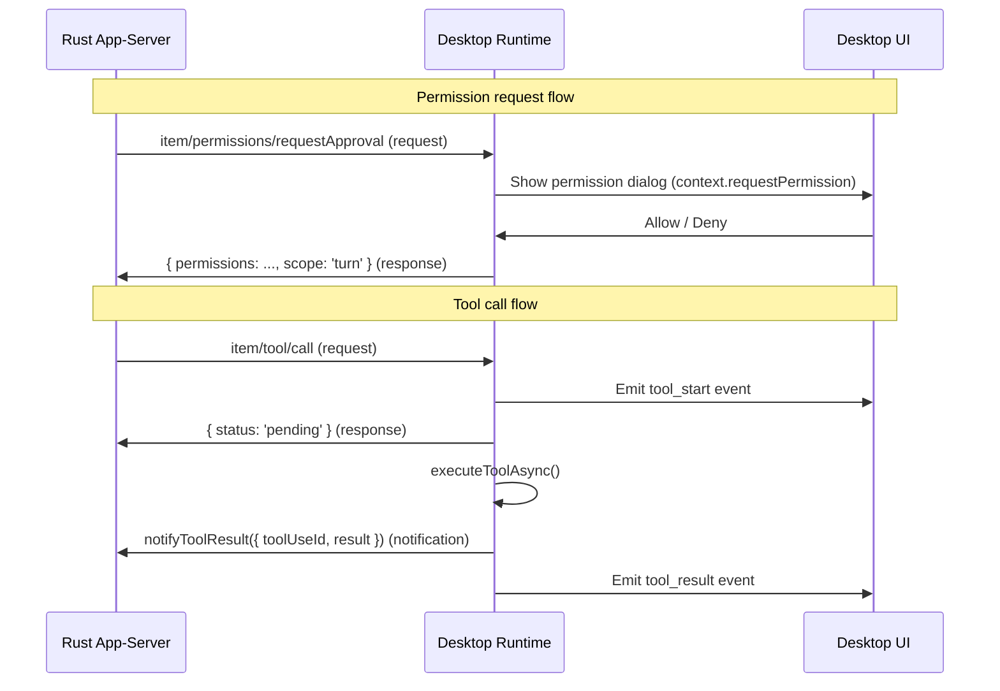

# Rust Sidecar Protocol Map

> Last updated: 2026-07-07

This document maps the protocol between the Electron desktop shell and the Rust
`codepilotx-app-server` sidecar process. It covers the first text-only integration
slice.

## Transport

| Property | Value |
|---|---|
| Protocol | JSON-RPC 2.0 |
| Framing | Newline-delimited JSON (one JSON object per line) |
| Direction | Bidirectional (request/response + server notifications) |
| Transport | stdin/stdout of the spawned `codepilotx-app-server` process |
| Client | `RustLineJsonRpcClient` → `RustAppServerClient` |

> **Contrast with TypeScript sidecar**: The TypeScript sidecar (`sidecarManager.ts`)
> uses `vscode-jsonrpc` with `Content-Length` header framing. The Rust sidecar
> is intentionally incompatible — it uses raw newline-delimited JSON.

---

## 1. Desktop Event → App-Server Request

| Desktop action | JSON-RPC method | Direction | Params | Response |
|---|---|---|---|---|
| Initialize session | `initialize` | Request → | `clientInfo`, `capabilities` | `InitializeResponse` |
| Notify ready | `initialized` | Notification → | (none) | — |
| Start thread | `thread/start` | Request → | `model`, `modelProvider`, `cwd`, `ephemeral` | `ThreadStartResponse` |
| Send user message | `turn/start` | Request → | `threadId`, `input[{text}]`, `model` | `TurnStartResponse` |
| Interrupt turn | `turn/interrupt` | Request → | `threadId`, `turnId` | `TurnInterruptResponse` (`{}`) |

### Initialize

```json
{"jsonrpc":"2.0","id":"1","method":"initialize","params":{"clientInfo":{"name":"codepilotx-desktop","title":"CodePilotX Desktop","version":"0.1.0"},"capabilities":{"experimentalApi":false,"requestAttestation":false}}}
```

### Initialized (notification — no response)

```json
{"jsonrpc":"2.0","method":"initialized"}
```

### Thread Start

```json
{"jsonrpc":"2.0","id":"2","method":"thread/start","params":{"model":"MiniMax-M3","modelProvider":"minimax-cn","cwd":"/workspace/path","ephemeral":true}}
```

### Turn Start (text-only)

```json
{"jsonrpc":"2.0","id":"3","method":"turn/start","params":{"threadId":"thread-abc","input":[{"type":"text","text":"Hello world","text_elements":[]}],"model":"MiniMax-M3"}}
```

### Turn Interrupt

```json
{"jsonrpc":"2.0","id":"4","method":"turn/interrupt","params":{"threadId":"thread-abc","turnId":"turn-xyz"}}
```

Response: `{"jsonrpc":"2.0","id":"4","result":{}}` (empty object).

---

## 2. App-Server Notification → Desktop Event

| Notification | Desktop event(s) | State effect |
|---|---|---|---|
| `thread/started` | (none emitted) | Stores `threadId` |
| `turn/started` | (none emitted) | Stores `activeTurnId`, clears delta buffer |
| `item/delta` | `partial_message` | Appends text to `assistantDeltaBuffer`; emitted text includes full buffer |
| `item/agentMessage/delta` | `partial_message` | Same as `item/delta` |
| `item/completed` (agentMessage) | `message(role=assistant)` | Emits final item text (not buffer); clears delta buffer |
| `item/completed` (dynamicToolCall) | `tool_result` | Emits result with success/error status |
| `item/completed` (commandExecution) | `tool_result` | Emits exit code, output, command metadata |
| `item/completed` (fileChange) | `tool_result` | Emits file change summary and status |
| `turn/completed` | `done` | Clears `activeTurnId`; clears delta buffer; resolves turn promise |
| `turn/plan/updated` | `proposed_plan` | Emits formatted plan steps with explanation |
| `item/plan/delta` | `proposed_plan` | Emits streaming plan delta |
| `reasoning/textDelta` | `partial_message` | Appends to buffer; emits reasoning prefix |
| `reasoning/summaryTextDelta` | `partial_message` | Appends to buffer; emits summary prefix |
| `item/commandExecution/outputDelta` | `partial_message` | Emits formatted command output for live display |
| `item/fileChange/patchUpdated` | `diff` (per file) | Emits diff events for each changed file with patch |
| `turn/diff/updated` | `diff` (aggregated) | Emits turn-level aggregated diff |
| `error` | `error` | Clears `activeTurnId`; clears delta buffer; resolves + rejects turn promise |
| Others | (debug-logged via `rust_adapter_unhandled_notification`) | Ignored |

### thread/started

```json
{"jsonrpc":"2.0","method":"thread/started","params":{"thread":{"id":"thread-abc"}}}
```

### turn/started

```json
{"jsonrpc":"2.0","method":"turn/started","params":{"turn":{"id":"turn-xyz"}}}
```

### item/delta

```json
{"jsonrpc":"2.0","method":"item/delta","params":{"threadId":"thread-abc","turnId":"turn-xyz","itemId":"item-1","itemDelta":{"text":"Hello, "}}}
```

Emitted as:
```typescript
{ type: 'partial_message', sessionId, text: 'Hello, ' }
```

### item/completed (agentMessage)

```json
{"jsonrpc":"2.0","method":"item/completed","params":{"item":{"type":"agentMessage","id":"item-1","text":"Hello, world!","phase":"final_answer"}}}
```

Emitted as:
```typescript
{ type: 'message', sessionId, role: 'assistant', text: 'Hello, world!' }
```

### turn/completed

```json
{"jsonrpc":"2.0","method":"turn/completed","params":{"threadId":"thread-abc","turn":{"id":"turn-xyz"}}}
```

Emitted as:
```typescript
{ type: 'done', sessionId }
```

### error

```json
{"jsonrpc":"2.0","method":"error","params":{"error":{"message":"Context window exceeded","codexErrorInfo":null,"additionalDetails":null}}}
```

Emitted as:
```typescript
{ type: 'error', sessionId, message: 'Context window exceeded' }
```

---

## 3. Provider Wire API Matrix

The Rust sidecar receives provider configuration via `-c` CLI arguments. The
`wire_api` setting determines which API protocol the Rust app-server uses to
talk to the LLM provider.

| Provider kind / ID | `wire_api` | Endpoint pattern | Auth mechanism |
|---|---|---|---|---|
| `anthropic` | `anthropic_messages` | Default Anthropic Messages API | `env_key` / api key |
| `anthropic-compatible` | `anthropic_messages` | Provider-specific base URL | `env_key` / api key |
| `minimax` | `anthropic_messages` | `https://api.minimaxi.com/anthropic/v1` | `x-api-key` header via `env_key` |
| `openai` (`@ai-sdk/openai`) | `responses` | Default OpenAI Responses API | `env_key` / api key |
| `openai-compatible` (default) | `responses` | Provider-specific base URL | `env_key` / api key |
| `deepseek` | `chat_completions` | `https://api.deepseek.com/chat/completions` | `DEEPSEEK_API_KEY` via `env_key` |
| `openai-compatible` (chat-only) | `chat_completions` | Provider-specific `/chat/completions` | `env_key` / api key |

### Configuration override pattern

Each provider generates CLI args like:

```
-c model="MiniMax-M3"
-c model_provider="minimax-cn"
-c model_providers.minimax-cn.name="MiniMax (minimaxi.com)"
-c model_providers.minimax-cn.wire_api="anthropic_messages"
-c model_providers.minimax-cn.base_url="https://api.minimaxi.com/anthropic/v1"
-c model_providers.minimax-cn.env_key="MINIMAX_API_KEY"
```

The API key is set via environment variable (`MINIMAX_API_KEY=sk-...`), never in
CLI args.

### Implementation location

- `createRustModelProviderOverrides()` in `rustSidecarRuntime.ts:156`
- `getRustProviderWireApi()` in `rustSidecarRuntime.ts:203`

---

## 3b. Server Requests (Permissions, Tool Calls, MCP Elicitation)

The Rust app-server can initiate JSON-RPC requests that the desktop client must
handle. These are registered via `setupServerRequestHandlers()` and use the
desktop permission system for user approval.

### Permission Requests

| Request | Permission tool_name | User interaction | Protocol response |
|---|---|---|---|
| `item/permissions/requestApproval` | `Permissions` | Shows permission dialog | `{ permissions: GrantedPermissionProfile, scope: 'turn' }` |
| `item/commandExecution/requestApproval` | `Bash` | Shows command execution dialog | `{ decision: 'accept' | 'decline' }` |
| `item/fileChange/requestApproval` | `ApplyPatch` | Shows file change dialog | `{ decision: 'accept' | 'decline' }` |

Permission requests are handled by `handlePermissionRequest()` which:
1. Builds a `DesktopPermissionRequest` using `buildDesktopPermissionRequestFromControlRequest()`
2. Calls `context.requestPermission()` and awaits the user decision
3. Maps the decision back to the Rust protocol response type

The handler **blocks** the JSON-RPC response until the user decides. The event
loop continues processing other messages during the wait.

### Tool Calls (`item/tool/call`)

The server requests tool execution on the desktop client. The handler:
1. Emits `tool_start` event for UI
2. Returns `{ status: 'pending' }` as JSON-RPC acknowledgment
3. Executes the tool asynchronously
4. Sends the result via `notifyToolResult` notification
5. Emits `tool_result` event for UI

**Current limitation**: The desktop client does not yet have a standalone tool
executor. The Rust server handles most common tools (Bash, Read, Write, Edit,
etc.) internally. If `item/tool/call` is received, the handler returns a "not
available" error.

In the future, the desktop can import and use TUI tool implementations for
client-side tool execution.

### MCP Elicitation (`mcpServer/elicitation/request`)

| Request | Permission tool_name | User interaction | Response |
|---|---|---|---|
| `mcpServer/elicitation/request` | `McpElicitation` | Shows permission dialog | `{ cancelled: true }` (form rendering not yet supported) |

**Current limitation**: MCP elicitation requests are acknowledged with
`{ cancelled: true }`. Full form rendering support requires desktop-side
form UI which is not yet implemented.

### Data flow



---

## 4. Supported & Unsupported Items

| Feature | Status | Notes |
|---|---|---|
| Text input | ✅ | Single string input |
| Non-text input (`ContentBlockParam[]`) | ❌ | Throws: `Rust sidecar currently supports text-only turns.` |
| Permission requests (commandExecution) | ✅ | Wired via `context.requestPermission()` |
| Permission requests (fileChange) | ✅ | Wired via `context.requestPermission()` |
| Permission requests (permissions/requestApproval) | ✅ | Wired via `context.requestPermission()` |
| Tool calls (`item/tool/call`) | ⚠️ | Acknowledged via `{ status: 'pending' }`, result via `notifyToolResult`. Tool execution returns "not available" for now. |
| Plan notifications | ✅ | `turn/plan/updated` and `item/plan/delta` → `proposed_plan` |
| Reasoning notifications | ✅ | `reasoning/textDelta` and `reasoning/summaryTextDelta` → `partial_message` |
| Command output deltas | ✅ | `item/commandExecution/outputDelta` → `partial_message` |
| File change patch updates | ✅ | `item/fileChange/patchUpdated` → `diff` events |
| Turn diff | ✅ | `turn/diff/updated` → `diff` (aggregated) |
| MCP elicitation | ⚠️ | Acknowledged but returns `{ cancelled: true }` (form rendering not supported) |
| MCP runtime status | ❌ | Returns empty array (no background query yet) |
| Concurrent turns | ❌ | Throws: `Rust sidecar does not support concurrent turns.` |
| Control responses (`runControlResponse`) | ❌ | Throws error (permissions handled directly in handler) |
| `/v1/chat/completions` provider API | ❌ | Future: see wire_api matrix |
| Websocket transport | ❌ | Overridden to `supports_websockets=false` |
| OpenAI auth header | ❌ | Overridden to `requires_openai_auth=false` |

---

## 5. Fallback Behavior

When the Rust sidecar binary is missing or fails to start (`SidecarStartError`):

| Runtime preference | Fallback target | Debug event |
|---|---|---|
| `rust-sidecar` | `InProcessDesktopAgentRuntime` (embedded headless) | `runtime_rust_sidecar_failed_fallback_embedded` |

Non-startup errors and user-aborted startup do **not** trigger silent fallback.

---

## 6. Key Files

| File | Purpose |
|---|---|
| `apps/desktop/src/main/rustSidecarRuntime.ts` | `RustSidecarDesktopAgentRuntime` — spawn/teardown/interrupt |
| `apps/desktop/src/main/rustAppServerClient.ts` | Typed JSON-RPC client for app-server methods |
| `apps/desktop/src/main/rustLineJsonRpcClient.ts` | Raw newline-delimited JSON-RPC transport |
| `apps/desktop/src/main/rustAppServerWorkflowAdapter.ts` | Maps server notifications to desktop events |
| `apps/desktop/src/main/rustAppServerProtocol/` | Generated TypeScript protocol types |
| `apps/desktop/src/main/agentRuntime.ts` | `RustFallbackDesktopAgentRuntime` — fallback wrapper |
| `apps/tui/src/appServer/` | TUI-side JSON-RPC server (reference implementation) |
